<table>
 <tr>
   <td align="center"><h1>Versal ACAP AI Engine A to Z Bare-metal Flow</h1>
   </td>
 </tr>

</table>

## Introduction

A platform is the starting point of your design and will be used to build Vitis™ software platform applications.

In this first section of the tutorial an example of how to create a new platform is shown. This starts with building the hardware system using the AI Engine in the Vivado® Design Suite.

This is in most ways a traditional Vivado design. You are building the platform, that is, the part of the design that you do not want the Vitis tools to configure or modify. This can include completely unrelated logic, any hierarchy you want to have in the design, but there are some rules that you must follow:

- Your design must contain an IP integrator block diagram containing the CIPS, NOC, and other infrastructure IP
- Your design must have at least one clock that you will expose to Vitis for use with any kernels that it adds
This clock must have an associated `proc_sys_reset` block.

This tutorial targets the VCK190 ES board (see https://www.xilinx.com/products/boards-and-kits/vck190.html). This board is currently available via early access. If you have already purchased this board, download the necessary files from the lounge and ensure you have the correct licenses installed. If you do not have a board and ES license please contact your Xilinx sales contact.


### Step 1. Create the Block Design

1. Open the Vivado Design Suite 2020.2 and create a new project. Name the project `custom_pfm_vck190`. Select the ***RTL Project*** as project type and check the ***Do not specify sources at this time*** and ***Project is an extensible Vitis platform*** boxes. In the parts selection page, use the ***Boards*** tab and select ***VCK 190 Evaluation Platform*** as the target hardware specification for this project. Click ***Finish*** to complete new project customization.

2. Create a new block design. The name of this BD file is arbitrary, but for the purpose of this tutorial call it `vck190_base`.

3. Add the CIPS (Control, Interfaces, and Processing System) IP from the IP catalog.

     

4. To avoid having to manually connect the CIPS and NoC blocks to get a working base configuration, click the ***Run Block Automation*** link that appears at the top of the IP integrator canvas. Configure the system with one memory controller, one PL clock, and one PL reset.

     

Your block design should look as follows:

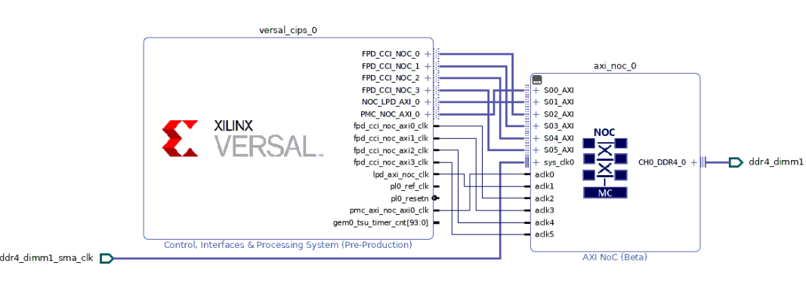

5. Double click on the CIPS to open its configuration GUI. In the Board Section select **cips_fixed_io** in the board interface section. This will configure the CIPS for the VCK190.

	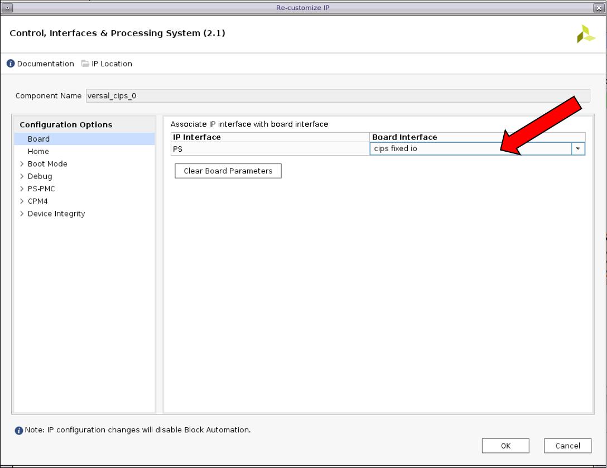
	
6. Double click on the AXI NoC IP to open its configuration GUI. In the Board tab select **ddr4_dimm1** in the board interface section for the line `CH0_DDR4_0` and **ddr4_dimm1_sma_clk** for the line `sys_clk0`. This will configure the AXI NoC for the DDR on the VCK190.

	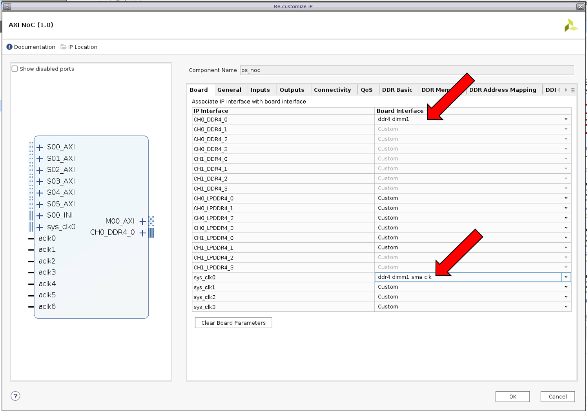
	
7. Rename the NoC block created by the automation tool (`axi_noc_0`) to `ps_noc` using the Block Properties window. This step is optional but allows a better understanding of the design.

8. Configure the `ps_noc` as shown in the following image (General Tab). The Inter-NoC Slave interface will be used to connect a second AXI NoC to the memory controller.

     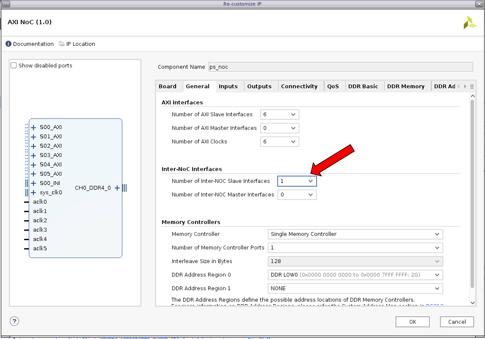

>**Note**: It is not mandatory to have multiple AXI NoCs. This design splits the AXI interfaces from the PS (with the `ps_noc`) and the AXI interfaces from the PL (with the `pl_noc` which will be added later).

9. Add an AI Engine IP from the IP catalog. Note that the design only requires the configuration interface from the Processing System, the rest of the connections will be made through the Vitis compiler later.

10. Run connection automation with the default settings to connect the AI Engine block to the PS NoC.

11. Double-click on the CIPS IP block to open its configuration wizard.

      a. Enable `M_AXI_FPD` with a data width of 128 bits.

      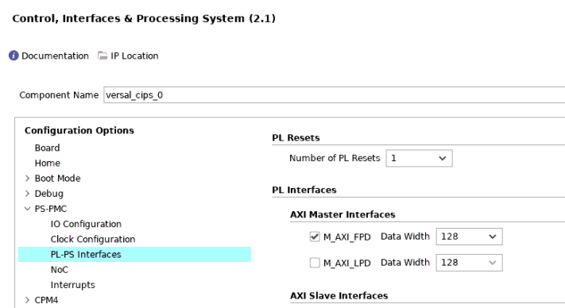

      b. Update the PL clock to output at 100 MHz.

      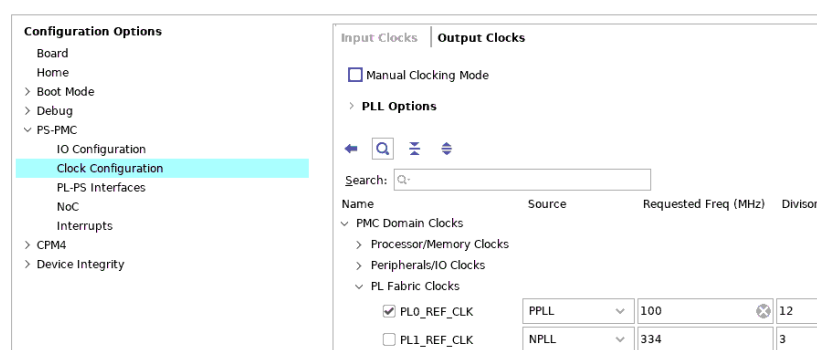

      c. Enable the PL-PS `IRQ0`.

      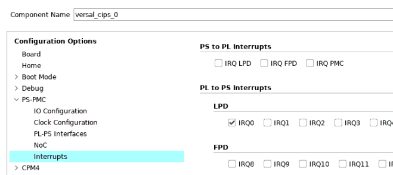

12. Add a Clocking Wizard IP. Double-click on the clocking wizard to open its configuration wizard.

      a. Enable three output clocks with the frequencies, 100 MHz, 150 MHz, and 300 MHz.

      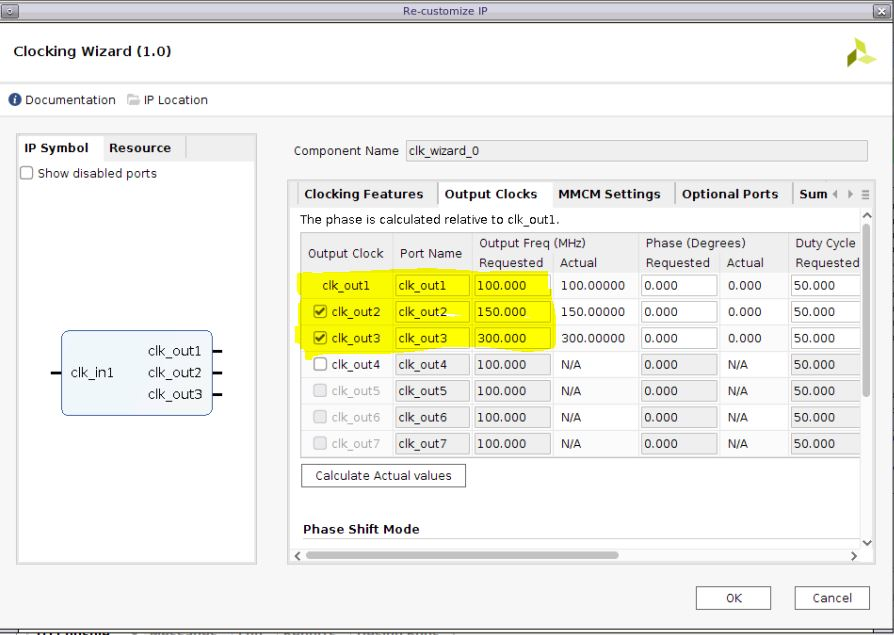

      b. Enable the locked output signal.

      

      c. Connect the `clk_in1` of the clocking wizard to the `pl0_ref_clk` of the CIPS IP.

13. Add three Processor System Reset IPs from the IP catalog. Run Connection Automation and configure the Processor System Reset IPs as follows:

      a. Select the `pl0_resetn` of the CIPS as the source for the external reset of all the Processor System Reset IPs.

      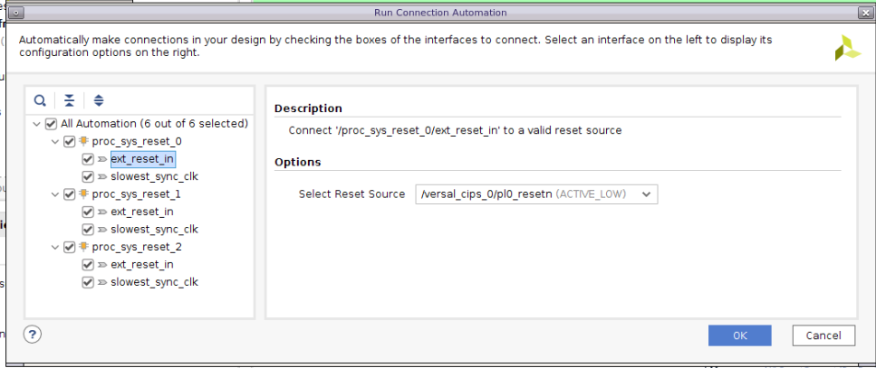

      b. For each Processor System Reset IP select one of the output clocks of the clocking wizard (`processor_sys_reset_0` -> `clk_out1`, `processor_sys_reset_1` -> `clk_out2`, `processor_sys_reset_2` -> `clk_out3`).

      

      c. Connect the `dcm_locked` input of all three Processor System Reset IPs to the locked output of the clocking wizard.

      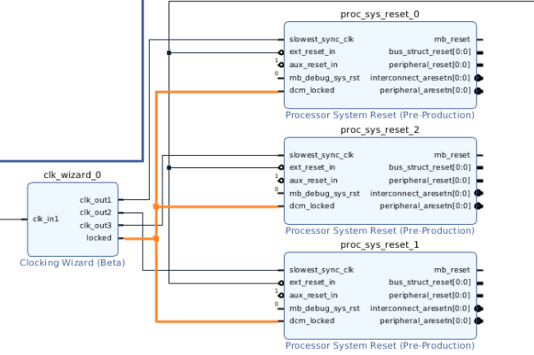

14. Add another AXI NoC IP to which the kernels will be connected and change its name to `pl_noc` in the Block Properties window.

      a. Configure the `pl_noc` to have zero AXI interfaces and one inter-NoC master interface. This NoC will be used as access to the memory for the IPs in the PL (example RTL kernels added from the Vitis tools):   

      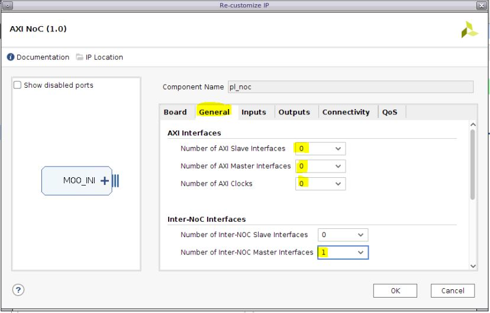

      b. In the ***Output*** tab of the NoC, change the INI connection strategy for `M00_INI` to ***Single Load (NSU/MC), Driver (NMU)***.

            

      c. Connect the `M00_INI` interface from the `pl_noc` to the `S00_INI` interface of the `ps_noc`.

15. Open the configuration wizard for the `ps_noc` and enable the connectivity of `S00_INI` to the MC Port 0.

      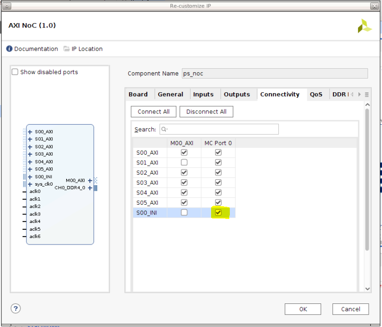

16. Add an AXI Smartconnect block from the IP catalog. This AXI Smartconnect will be used for the AXI4-Lite slave interfaces of the PL IPs (to be controlled from the PS). Configure the AXI Smartconnect as follows:

      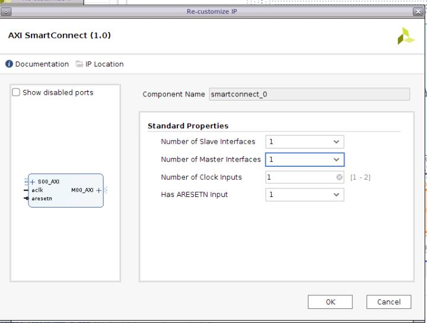     

17. Connect the `M_AXI_FPD` interface from the CIPS to the `S00_AXI` interface of the AXI Smartconnect.

18. Run connection automation and make sure the clock source is `clk_out1`.

      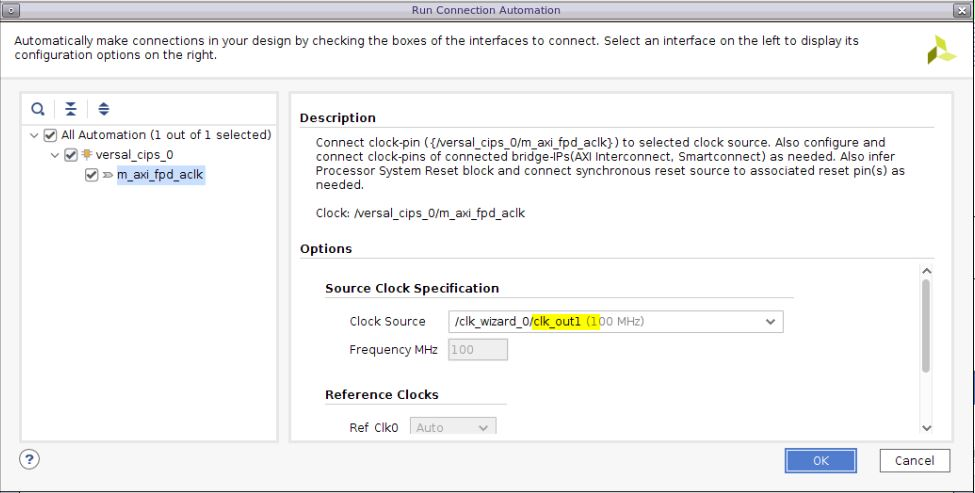

19. Connect the `aresetn` input of the Smartconnect to the `interconnect_aresetn` output of the `processor_sys_reset_0` IP.

20. Add an AXI Interrupt Controller IP from the IP catalog and configure it as follows:

      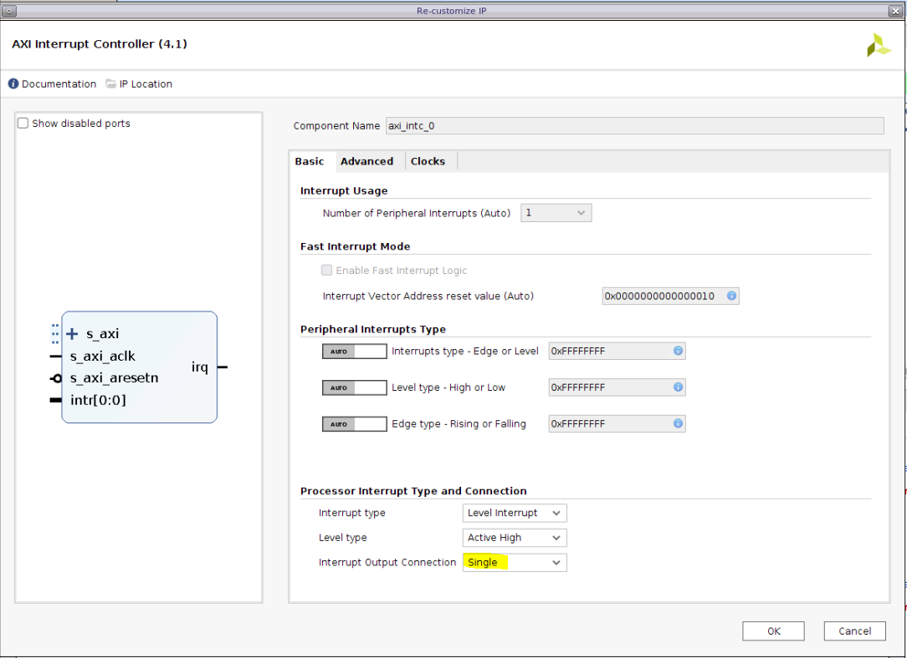

Click Run connection automation and configure it as follows:

  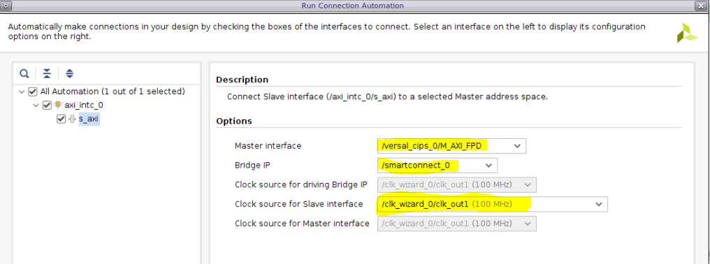

Connect the `irq` output of the AXI Interrupt Controller IP to the `pl_ps_irq0` input of the CIPS IP.

21. The finished block design should look similar to the following:

      

Validate the design and you should see no errors. There might be a warning related to the AXI Interrupt Controller IP which you can ignore.


### Step 2. Apply Vitis Platform Attributes and Package the Platform

In this step, the platform interfaces are exposed to the Vitis software platform.

1. Enable the platform window by clicking ***Window > Platform Setup***. You will see different settings for AXI ports, clocking, and interrupts.

2. In the Clock section, under the clocking wizard, select Enabled for all the clocks to enable them for platform use.
Set the `clk_out1` id to `1`. Set the `clk_out2` id to `0` and enable `is_default`. Set the `clk_out3` id to `2`.

      

The preceding operations can also be done using the following Tcl commands.

```
set_property PFM.CLOCK { \
    clk_out1 {id "1" is_default "false" proc_sys_reset "/proc_sys_reset_0" status "fixed"} \
    clk_out2 {id "0" is_default "true" proc_sys_reset "/proc_sys_reset_1" status "fixed"} \
    clk_out3 {id "2" is_default "false" proc_sys_reset "/proc_sys_reset_2" status "fixed"}} [get_bd_cells /clk_wizard_0]
 ```

3. Select the ***S00_AXI*** to ***S15_AXI*** interfaces of the `pl_noc` and right-click to enable them.

      

The preceding operations can also be done using the following Tcl commands.

```
set noc_slaves []
for {set i 0} {$i < 16} {incr i} {
    lappend noc_slaves S[format %02d $i]_AXI {memport "MIG" sptag "MC_NOC0" memory "axi_noc_mc_4int C0_DDR_LOW0"}
}
set_property PFM.AXI_PORT $noc_slaves [get_bd_cells /pl_noc]
```

4. In the AXI Ports section, select ***M01_AXI*** to ***M15_AXI*** under `smartconnect_0` and right-click to enable them. For each interface, change the memport setting to `M_AXI_GP`.

      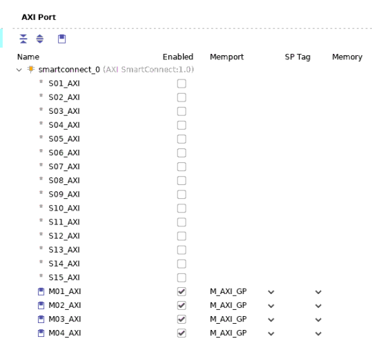

The preceding operations can also be done using the following Tcl commands.
```
set axi_sc_masters []
for {set i 1} {$i < 16} {incr i} {
    lappend axi_sc_masters M[format %02d $i]_AXI {memport "M_AXI_GP" sptag "" memory ""}
}
set_property PFM.AXI_PORT $axi_sc_masters [get_bd_cells /smartconnect_0]
```

5. In the Interrupt section, enable ***intr*** under `axi_intc_0` to enable the IRQ inputs for the AXI interrupt controller for the platform.
The preceding operations can also be done using the following Tcl command.
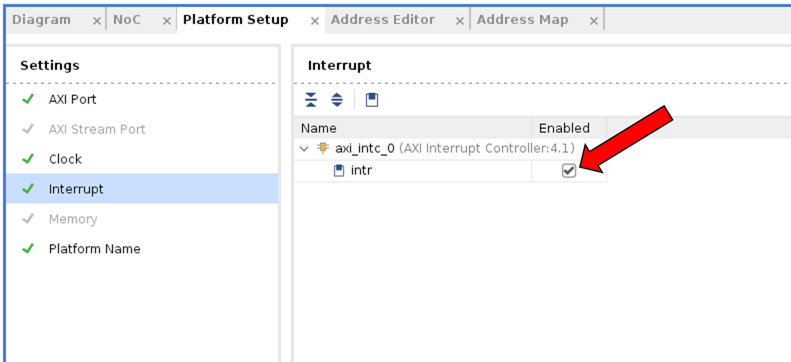
```
set_property PFM.IRQ {intr {id 0 range 32}} [get_bd_cells /axi_intc_0]
```

6. Run the following Tcl command to set up platform property to expose the `M00_AXI` port of the NoC so the AI Engine IP can be detected by the Vitis tools.
```
set_property PFM.AXI_PORT {M00_AXI {memport "NOC_MASTER"}} [get_bd_cells /ps_noc]
```

7. Set the following platform properties using the following Tcl commands.
```
set_property platform.default_output_type "sd_card" [current_project]
set_property platform.design_intent.embedded "true" [current_project]
set_property platform.design_intent.server_managed "false" [current_project]
set_property platform.design_intent.external_host "false" [current_project]
set_property platform.design_intent.datacenter "false" [current_project]
set_property platform.uses_pr  "false" [current_project]
```

A Tcl script is also provided in the `script` folder. You can run it to restore the block design creation work.

### Step 3. Build the Design and Generate the XSA

1. Generate the BD output products by right-clicking on the BD file from the sources window and clicking on ***Generate Output Products...***.

      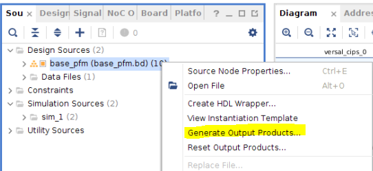

2. Create a HDL wrapper for the BD by right-clicking on the BD from the sources window and clicking on ***Create HDL Wrapper***.

      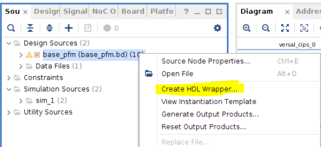

3. Export the XSA using ***File > Export > Export platform***.

      a. On the first page, select ***Hardware*** as the platform type (this tutorial runs on hardware).
          

      b. On the second page select ***Pre-synthesis***.

      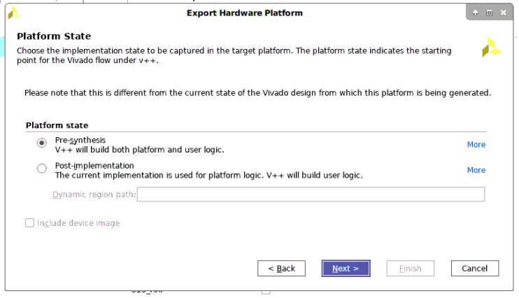     

      c. On the third page, add the name of the platform.

      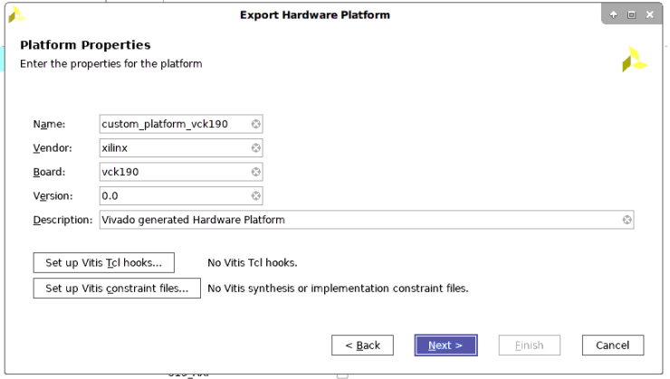    

      d. On the fourth page, set the name of the XSA.

      

4. Close the Vivado project.

### Step 4. Build the Platform in the Vitis Software Platform

1. Open the Vitis 2020.2 IDE and select a workspace.

2. On the Welcome Page, select ***Create Platform Project*** or select ***File → New →  Platform Project ...***.

3. Set the platform project name to ***base_pfm_vck190*** and click ***Next***.

      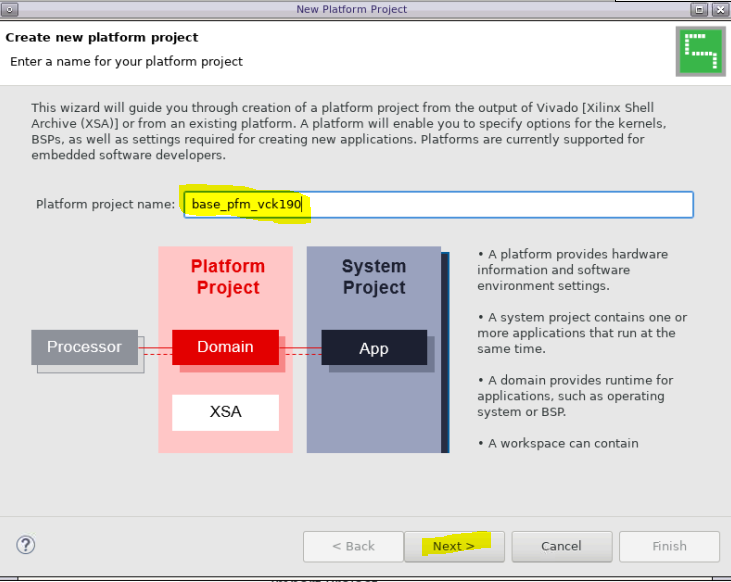

4. Use the XSA generated in the previous step and set the Operating System to  ***aie_runtime*** and the Processor to ***ai_engine***.

      

5. Then build the platform by clicking on the hammer icon.

      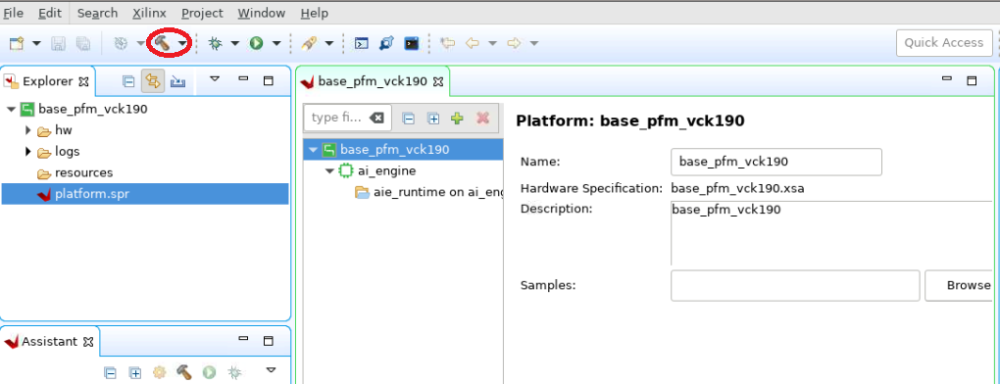
>**Note**: If you modify the XSA file later, first right-click the platform project and select ***Update Hardware Specification*** and then rebuild the platform project.

6. The generated platform can be found in `base_pfm_vck190/export`.

In this step, you created the platform starting with building the hardware platform in the Vivado Design Suite. Then, you built the platform in the Vitis software platform, based on the exported XSA file.

In the next step, you will build an AI Engine application using this platform.

<p align="center"><b><a href="./README.md">Return to Start of Tutorial</a> — <a href="./02-aie_application_creation.md">Go to Step 2</a></b></p>

<p align="center">© Copyright 2020 Xilinx, Inc.</p>

Licensed under the Apache License, Version 2.0 (the "License");
you may not use this file except in compliance with the License.
You may obtain a copy of the License at

    http://www.apache.org/licenses/LICENSE-2.0

Unless required by applicable law or agreed to in writing, software
distributed under the License is distributed on an "AS IS" BASIS,
WITHOUT WARRANTIES OR CONDITIONS OF ANY KIND, either express or implied.
See the License for the specific language governing permissions and
limitations under the License.

<p align="center"><sup>XD018</sup></p>
