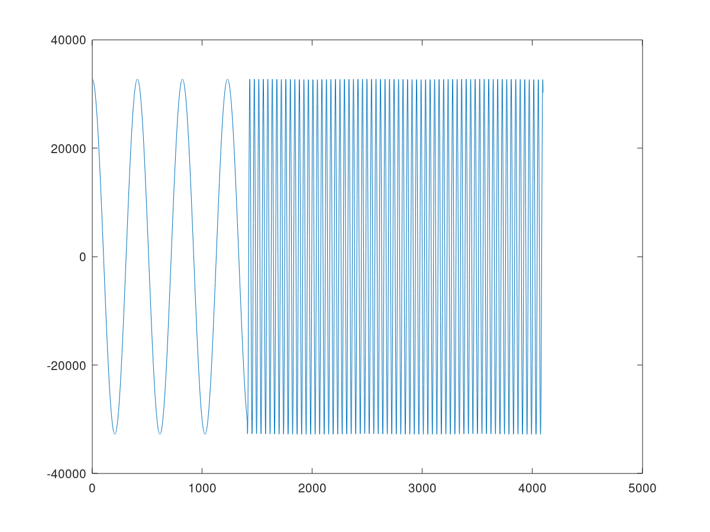

<table class="sphinxhide" width="100%">
 <tr width="100%">
    <td align="center"><h1>AI Engine Development</h1>
    <a href="https://www.xilinx.com/products/design-tools/vitis.html">See Vitis™ Development Environment on xilinx.com </a>
    <a href="https://www.xilinx.com/products/design-tools/vitis/vitis-ai.html">See Vitis™ AI Development Environment on xilinx.com</a>
    </td>
 </tr>
</table>

# Asynchronous Update of Scalar RTP

This example demonstrates how to declare an asynchronous runtime parameter. Once an asynchronous runtime parameter is triggered for the first time, the kernel will start to execute and will continue to execute for many iterations without waiting for the next trigger. The value of the asynchronous runtime parameter remains the same until the next trigger updates the value.

The example is similar to [Synchronous Update of Scalar RTP](./step1_sync_scalar.md), with the exception of the code to handle the asynchronous runtime parameter.

__Note:__ The default working directory in this step is `step2`, unless specified explicitly otherwise.

## Review RTP Update Code

Open `aie/graph.h`. Examine the code to connect the trigger input port of the graph to the first input port of the dds kernel (i.e., the `phase_increment` parameter of the sine function).

	//connect asynchronous runtime parameter
	adf::connect<adf::parameter>(trigger, adf::async(dds.in[0]));

__Note__: You need to use **adf::async** to indicate that the first port (`phase_increment` parameter) of the dds kernel will be updated asynchronously.

Open `aie/graph.cpp`. Check the code that first updates the trigger input port of the graph has the value 10 in the ping buffer. Then run it for two iterations. Wait for the two iterations to complete, then update the trigger input port of the graph with the value 100 in the pong buffer. Run it for another two iterations and then end. 

	gr.init();
	// asynchronous RTP trigger calls
	gr.update(gr.trigger,10);
	gr.run(2);
	gr.wait();
	gr.update(gr.trigger,100);
	gr.run(2);
	gr.end();

Notice that using this code, the result is the same as that in the example given in step 1, but they are in different control modes. In synchronous RTP mode, the graph run is implicitly controlled by the RTP update, while in asynchronous RTP mode, the "`_wait()_`" function is used to explictly wait the graph running to be completed. In asynchronous RTP mode, there is no guarantee when the RTP update will be effective while the graph is running. 

## Run AI Engine Compiler and AI Engine Simulator

Run the following make command to compile the design graph (`libadf.a`):
	
	make aie
	
Run the following make command to launch the AI Engine simulator:
	
	make aiesim
	
After simulation, check the output data by running the following commands:
	
	grep -v T aiesimulator_output/data/output.txt > aiesimulator_output/data/output_data.txt
	diff -w aiesimulator_output/data/output_data.txt ./data/golden.txt

To explore how asynchronous RTP updates are effective, you can replace the code in the `main()` function of `aie/graph.cpp` with the following code (do this manually):

	gr.init();
	gr.run();
	gr.update(gr.trigger,10);
	gr.wait(/*timeout cycles=*/5000);
	gr.update(gr.trigger,100);
	gr.resume();
	gr.end(/*timeout cycles=*/10000);

In this code, the graph is set up to run forever. However, after the `run` API is called, it will still block the first update for parameter initialization. Then, it will run for 5000 cycles (approximately) before allowing the control thread to make another update. The new update will take effect at the next kernel invocation boundary. Then the graph is allowed to run for another
10,000 cycles before terminating.

Run the AI Engine simulator and trim the timestamps from the output data file:

	make aiesim
	grep -v T aiesimulator_output/data/output.txt > aiesimulator_output/data/output_data.txt

Then plot the data (only the real part) using the following commands in Octave:
	
	data=load("aiesimulator_output/data/output_data.txt")
	plot(data(:,1))

You can change the timeout cycle numbers in different runs and plot output data to observe how aynchronous RTP updates work.

## Run Hardware Cosimulation and Hardware Flow

The Makefile rule targets introduced in [Synchronous Update of Scalar RTP](./step1_sync_scalar.md) still apply here. However, you can run the following make command to compile and build all the dependent files for the package (this is for `hw_emu`):

	make package

For hw mode, run the following command:
	
	make package TARGET=hw
	
After the package step, run hardware emulation using the following command:
	
	make run_hw_emu
	
In the Linux prompt, run following commands:

	mount /dev/mmcblk0p1 /mnt
	cd /mnt
	export XILINX_XRT=/usr
	export XCL_EMULATION_MODE=hw_emu
	./host.exe a.xclbin

To exit QEMU press Ctrl+A, x

Alternatively, to run in hardware, after booting Linux from an SD card, run the following commands in the Linux prompt:

	mount /dev/mmcblk0p1 /mnt
	cd /mnt
	export XILINX_XRT=/usr
	./host.exe a.xclbin

The host code is self-checking. It will check the output data against the golden data. If the output data matches the golden data after the run is complete, it will print the following:

	TEST PASSED

## Conclusion

In this step, you learned learned about the core concepts of asynchronous update of scalar RTP, and how to control the execution between different RTP updates.

Next, review [Asynchronous Update of Array RTP](./step3_async_array.md).

### Support

GitHub issues will be used for tracking requests and bugs. For questions go to [forums.xilinx.com](http://forums.xilinx.com/).

Copyright © 2020–2023 Advanced Micro Devices, Inc

<a href="https://www.amd.com/en/corporate/copyright">Terms and Conditions</a>

