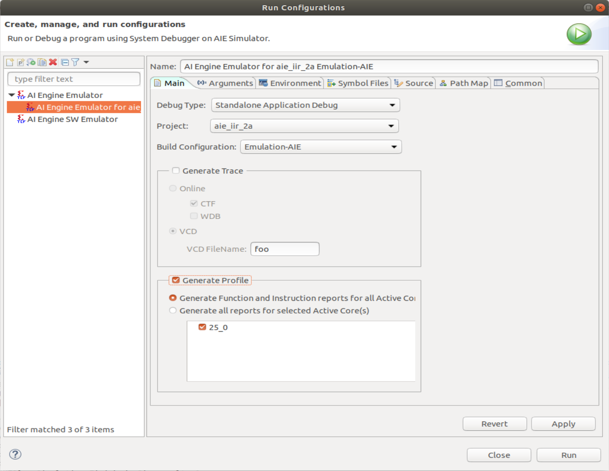
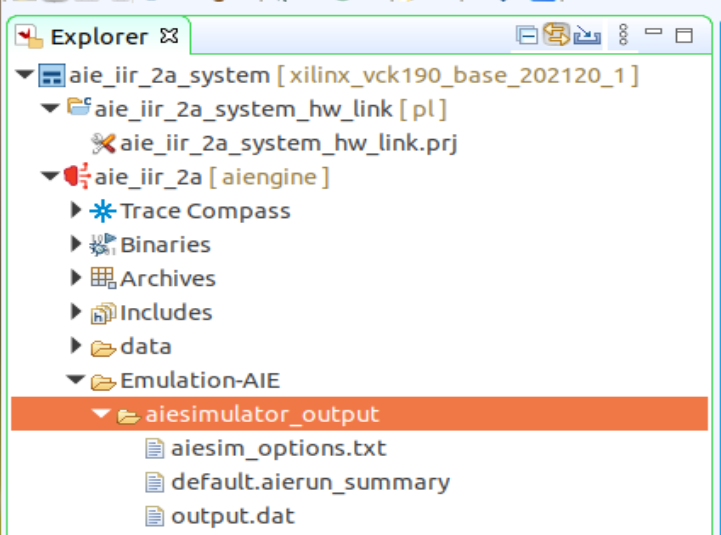
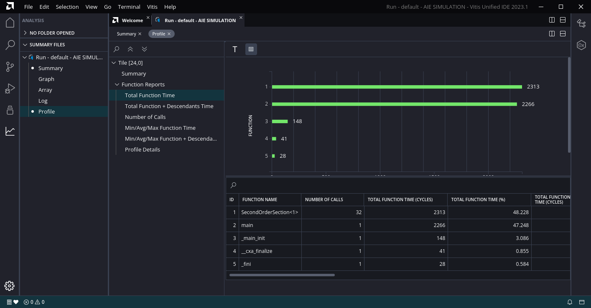
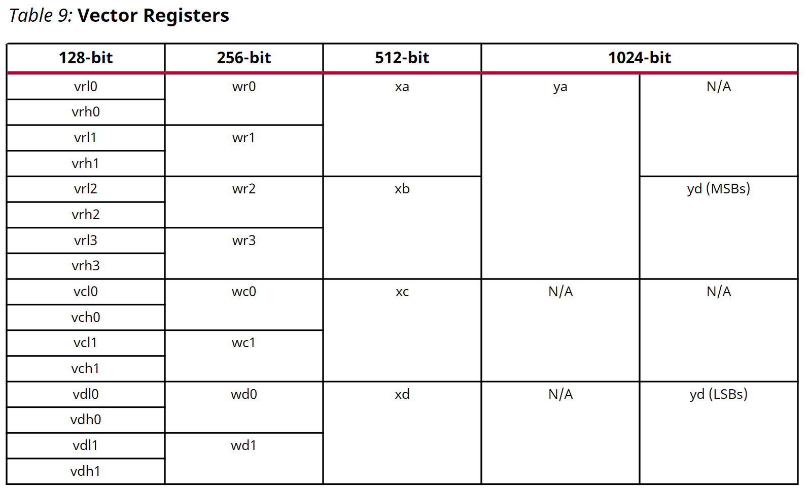

<table class="sphinxhide" width="100%">
 <tr width="100%">
    <td align="center"><h1>AI Engine Development</h1>
    <a href="https://www.xilinx.com/products/design-tools/vitis.html">See Vitis™ Development Environment on xilinx.com</br></a>
    <a href="https://www.xilinx.com/products/design-tools/vitis/vitis-ai.html">See Vitis-AI™ Development Environment on xilinx.com</a>
    </td>
 </tr>
</table>

# Implementing an IIR Filter on the AI Engine - Part 2a

***Version: Vitis 2023.1***

## Preliminaries

In Part 1a, we focused on vectorizing the calculation for a second order section of an IIR filter using Emulation-SW mode. Using eqn. (4) in Part 1a, we saw that we can calculate 8 consecutive outputs by multiplying an 8x12 matrix of constants with a 12x1 vector (composed of 8 consecutive inputs and 4 states).


From Fig. 26 of [AM009](https://www.xilinx.com/support/documentation/architecture-manuals/am009-versal-ai-engine.pdf), we can see that the floating-point vector processor can perform 8 multiply-accumulate operations on floating-point operands in 2 cycles, in E6 and E7. Note that the red dashed arrow in the figure indicates the feedback path for the accumulator. Thus, *ideally*, 12*2=24 cycles would be the minimum required to calculate 8 floating-point outputs.


In this and succeeding sections, we will *attempt* to minimize latency and maximize throughput while showing the typical steps to analyze and optimize a design.

Notes:
* The Julia scipt `aie_iir_2a.jl` generates the coefficients for the specified IIR filter, as well as the header file required by the program. It also generates an [impulse signal](https://www.dsprelated.com/freebooks/filters/Impulse_Response_Representation.html) and the filter's response.
  * The generated header file should be moved to the `src` directory
  * The generated `*.dat` files should be moved to the `data` directory
* The Julia script `check.jl` calculates the difference between the golden impulse response generated by `aie_iir_2a.jl` and the output of the AI engine.

## Kernel Code

As a first step, we use the kernel code shown below.
```C++
template<unsigned id>
void SecondOrderSection(
	adf::input_buffer<float> & __restrict idata,	// 8 input samples per iteration
	adf::output_buffer<float> & __restrict odata,	// 8 output samples per iteration
    const float (&C)[96]	// RTP port for coefficient matrix
) {

	static Vector8f state_reg = aie::zeros<float, 8>();	// clear states

	// input/output iterators
	auto inIter = aie::begin_vector<8>(idata);
	auto outIter = aie::begin_vector<8>(odata);

	Vector8f xreg_hi = *inIter++;		// fetch input samples
	Vector16f xreg = aie::concat(state_reg, xreg_hi);	// xreg[4]: ym2; xreg[5]: ym1; xreg[6]: xm2; xreg[7]: xm1; xreg[8:15]: x0:x7
	Vector8f coeff;
	VAcc8f acc = aie::zeros<accfloat, 8>();

	for (auto i = 0; i < 12; i++) {
		coeff = aie::load_v<8>(&C[8 * i]);
		float xval = xreg[i + 4];
		acc = aie::mac(acc, coeff, xval);
	} // end for (auto i = 0; i < 12; i++)

	Vector8f yout = acc;	// transfer accumulator register to vector register to update states

	// update states
	state_reg = xreg_hi;
	state_reg[4] = yout[6];
	state_reg[5] = yout[7];

	*outIter++ = yout;

} // end SecondOrderSection()
```
The `for` loop scales each column of the coefficient matrix with an element in `xreg` and accumulates the result. This performs the matrix and vector multiplication in eqn. (4).

## Testbench Code
```C++
#include "kernel.hpp"
#include "graph.hpp"
#include "C1.h"

using namespace std;

using namespace adf;

// specify the dataflow graph (DFG)
the_graph my_graph;

const unsigned num_pts = 256;			// number of sample points in "input.dat"
const unsigned num_iterations = num_pts/8;	// number of iterations to run

// main simulation program
int main() {

	my_graph.init();				// load the DFG into the AI engine array, establish     connectivity, etc.

	my_graph.update(my_graph.cmtx1, C1, 96);	// transfer coefficients

	my_graph.run(num_iterations);	// run the DFG for the specified number of iterations

	my_graph.end();					// terminate AI engine processing

	return (0);

} // end main()

```
The testbench
* initializes the graph
* loads the filter coefficients
* runs the graph 32 times
* terminates all processing

## Analysis

We begin by setting the `Active build configuration` to `Emulation-AIE` and building the design with the default optimization level (xlopt = 1). After a successful build, right-click on `aie_iir_2a [aiengine]` and select `Run As` -> `Launch AIE Emulator`. After a successful simulation, we can now enable profiling. Right-click on `aie_iir_2a [aiengine]`, select `Run Configurations...`, and click on `Generate Profile` in the `Run Configurations` window [Note: it may be necessary to increase the height of the `Run Configurations` window to see the `Generate Profile` section].



Click the `Run` button to re-run with profiling enabled.

After the simulation completes, the "goodness" of the result can be checked by running:
```bash
$ julia check.jl aie
```
The result is "good" when the `maximum(abs.(err))` is less than `eps(Float32)`.


To view the profiler result, in the `Explorer` pane, expand `Emulation-AIE` and `aiesimulator_output`.



Double-click on `default.aierun_summary` to open the report in `Vitis Analyzer`.

In the `Vitis Analyzer` window, click on `Profile` in the browser pane (leftmost pane), then `Total Function Time` to show the number of cycles consumed by each function.



Note that the kernel function, `SecondOrderSection<1>` was executed 32 times and ran for a total of 2,313 cycles. Each function call consumed 2,313/32 = 72.28 cycles. The minimum function time is 72 cycles and the maximum is 81 cycles. This implies that the first call consumed an additional 9 cycles (81 + 31 * 72 = 2,313).

Another item of interest is the top-level `main` function which calls `my_graph.run()`, which in turn, calls `SecondOrderSection<1>`. The `Total Function + Descendants Time (cycles)` column shows the number of cycles consumed by that function, including all other routines called within it. This includes setting up the heap and stack, initialization, actual processing, etc. For this implementation, 4,579 cycles were used to process 256 samples, or 4579/256 = 17.89 cycles/sample. Assuming that the AI engine runs with a 1GHz clock, the throughput is then 1e9 cycles/sec / 17.89 cycles/sample =  55.897 Msamples/sec.

Note that the main processing occurs in `SecondOrderSection<1>`, which consumes 2,313 cycles. Thus, there are 4,579 - 2,313 = 2,266 unavoidable "overhead" cycles which are not used for sample processing.

Click on `Profile Details` to view the generated assembly code.


Scroll down to where the `VFPMAC` assembler mnemonics become visible.


From the kernel code, note that the statement:
```C++
acc = aie::mac(acc, coeff, xval);   // acc[] += coeff[] * xval
```
generates the `VFPMAC` mnemonic (vector floating-point multiply-accumulate). Also note that the `for` loop has been unrolled, and that there is a `NOP` (no operation) between each `VFPMAC` to account for the 2-cycle floating-point accumulation latency.

`VFPMAC` uses a 1024-bit `y` register as an input buffer (see Table 9 of [AM009](https://www.xilinx.com/support/documentation/architecture-manuals/am009-versal-ai-engine.pdf)).



The `ya` register is composed of the 256-bit `wr[0:3]` registers. For this example, the `wr0` register is updated with the columns of the coefficient matrix using the `VLDA` (vector load A) mnemonic. The `VLDA` mnemonic transfers 8 floating-point values from data memory to a vector register. In this example, there is a 7 to 8 cycle latency from the `VLDA` mnemonic (loading data into `wr0`) to the time the data is used for computation with `VFPMAC`.

## Conclusion

We showed how to calculate a floating-point 8x12 matrix and 12x1 vector multiplication using a `for` loop and the AI engine APIs in 73 cycles. We also showed how to use Vitis Analyzer to view some statistics of the generated program (e.g. cycles consumed) as well as examine the generated assembler code.

In Part 2b, we will attempt to further optimize the program to achieve a multiply-accumulate operation on every cycle.

# Support

GitHub issues will be used for tracking requests and bugs. For questions go to [forums.xilinx.com](http://forums.xilinx.com/).

<p class="sphinxhide" align="center"><sub>Copyright © 2020–2023 Advanced Micro Devices, Inc</sub></p>

<p class="sphinxhide" align="center"><sup><a href="https://www.amd.com/en/corporate/copyright">Terms and Conditions</a></sup></p>
