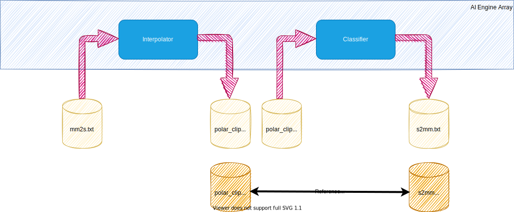
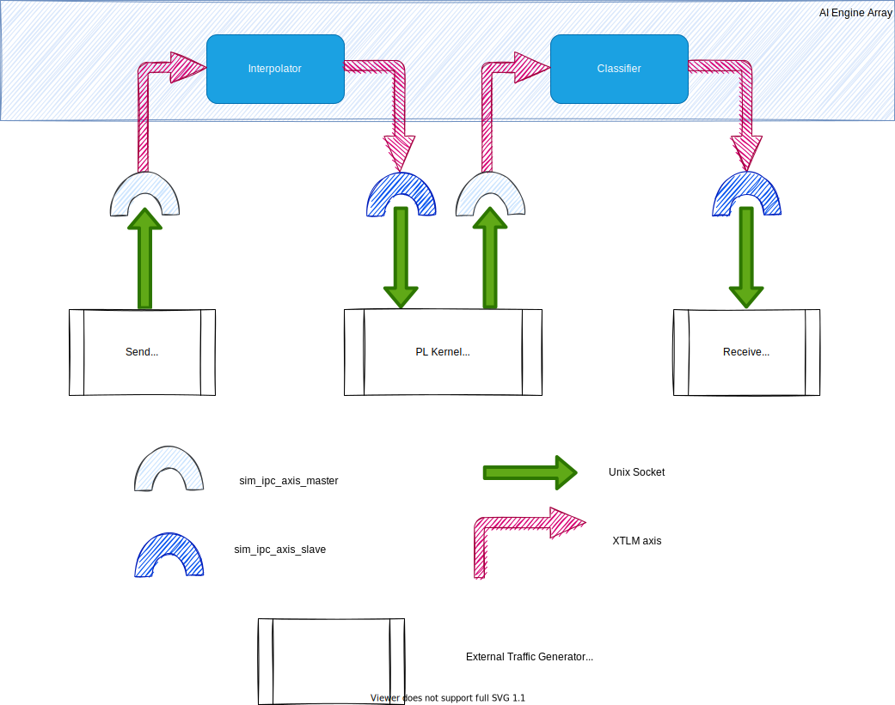
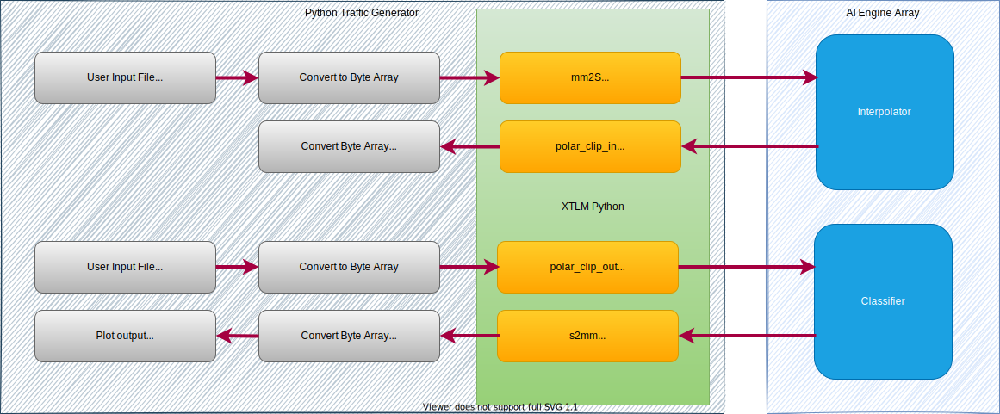
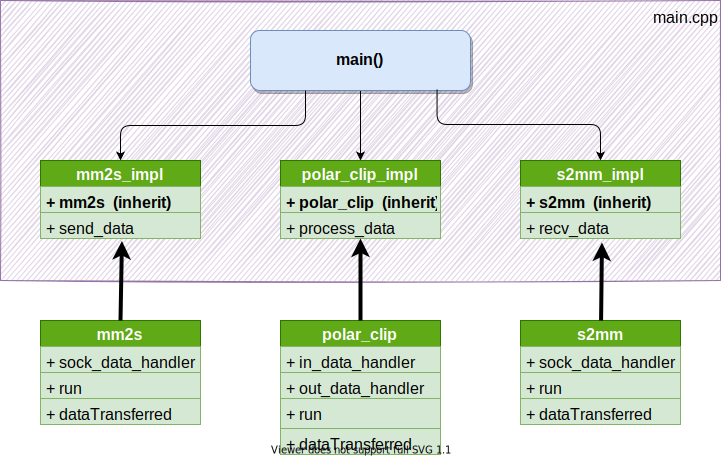

<table class="sphinxhide" width="100%">
 <tr width="100%">
    <td align="center"><h1>AI Engine Development</h1>
    <a href="https://www.xilinx.com/products/design-tools/vitis.html">See Vitis™ Development Environment on xilinx.com</br></a>
    <a href="https://www.xilinx.com/products/design-tools/vitis/vitis-ai.html">See Vitis™ AI Development Environment on xilinx.com</a>
    </td>
 </tr>
</table>

# Python and C++ External Traffic Generators for AI Engine Simulation and Emulation Flows

***Version: Vitis 2022.2***

## Introduction

Versal™ adaptive compute acceleration platforms (ACAPs) combine Scalar Engines, Adaptable Engines, and Intelligent Engines with leading-edge memory and interfacing technologies to deliver powerful heterogeneous acceleration for any application. In a bottom-up approach, each part of system is simulated independently before being integrated in a more complete simulation. An heterogeneous device as the Versal ACAP authorizes dataflows to go through a diversity of engines for completion.

This tutorial develops a case in which the dataflow goes back and forth multiple times between the programmable logic (PL) and the AI Engine array. Some PL blocks are only source or destination kernels, whereas others are processing kernels within the dataflow. This tutorial demonstrates how to create external traffic generators as Python scripts or C++ applications to exercise the AI Engine kernels in the x86 simulator (`x86simulator`), AI Engine simulator (`aiesimulator`), and in hardware emulation (`hw_emu`).

### Objectives

After completing the tutorial, you will be able to do the following:

* Create a Python script or C++ application.
* Pass data between the traffic generator and the AI Engine through specific ports.
* Capture and send data and display using Python.
* Capture and send data using C++.
* Compile and simulate a design.
* Understand the necessary code changes in the graph and host to make the design work seamlessly between `x86simulator`, `aiesimulator`, and `hw_emu`.
* Bring up results in Vitis Analyzer.

### Before You Begin

This tutorial uses Python. In addition to having the Xilinx tools installed, you also need a valid installation of Python 3.

#### Python Environment Setup

The external traffic generators use Python and require non-standard packages to be installed. Perform the following steps to install these packages.

1. Make sure you are using the latest version of Python 3. This tutorial has been developed with version 3.6.5. Run the following command to check the version:

    ```bash
    python3 --version
    ```

2. Install the appropriate packges using `pip`.

    ```bash
    pip3 install requirements.txt
    ```

    This file contains the following packages:

    ```txt
    numpy
    multiprocessing
    struct
    matplotlib
    ```
3. Validate your environment by running the following command. If errors are reported during import, rerun `pip` and install the packages manually.

    ```bash
    python3 -c 'import numpy, matplotlib, struct, multiprocessing'
    ```


4. Add the provided packages for external traffic generators to the `PYTHONPATH`. Run the following command:

    ```bash
    export PYTHONPATH=${XILINX_VIVADO}/data/emulation/hw_em/lib/python/:${XILINX_VIVADO}/data/emulation/ip_utils/xtlm_ipc/xtlm_ipc_v1_0/python/:$XILINX_VIVADO/data/emulation/python/xtlm_ipc:${PYTHONPATH}
    ```

**IMPORTANT**: Before beginning the tutorial make sure you have read and followed the *Vitis Software Platform Release Notes* (v2022.2) for setting up software and installing the VCK190 base platform.

Before starting this tutorial run the following steps.

1. Set up your platform by running the `xilinx-versal-common-v2022.2/environment-setup-cortexa72-cortexa53-xilinx-linux` script as provided in the platform download. This script sets up the `SYSROOT` and `CXX` variables. If the script is not present, you _must_ run `xilinx-versal-common-v2022.2/sdk.sh`.
2. Set up your ROOTFS to point to the `xilinx-versal-common-v2022.2/rootfs.ext4`.
3. Set up your IMAGE to point to `xilinx-versal-common-v2022.2/Image`.
4. Set up your `PLATFORM_REPO_PATHS` environment variable based upon where you downloaded the platform.


Before starting this tutorial, run the following steps.

1. Set up the following paths in the script `env_setup.sh`:

```bash

export XILINX_TOOLS_LOCATION=<Path to Vitis Build - Directory>/Vitis/2022.2
export PLATFORM_REPO_PATHS=<YOUR-PLATFORMS-DIRECTORY>
export XILINX_VERSAL_SW=<Path to xilinx-versal-common-v2022.2 - Directory>
export XILINX_XRT=/<user-path>/opt/xilinx/xrt
export PYTHON3_LOCATION=<user-path>
```

2. This env_setup.sh sets the necessary paths to run the tutorial:

    - `ROOTFS`, `IMAGE`, `SYSROOT`, `CXX`, and `SDKTARGETSYSROOT` for host software compilation.
    - `LIBRARY_PATH` to handle external traffic generator handles.
    - `PATH` and `PYTHONPATH` for the Python-based external traffic generator.

```
export PYTHON3_LOCATION=<user-path>
```


2. Run the `source env_setup.sh` script in the console.


## Design Overview

This tutorial is based on a basic design, as shown below. This design contains two AI Engine kernels with an intermediate kernel in the PL. The overall system is fed and flushed from kernels that are also in the PL.


In a standard simulation scheme, you would have to perform several steps:

- In `x86simulator` and `aiesimulator`, you would have to replace `mm2s` and the output of `polar_clip` with text test vectors and verify that the input of `polar_cip` and `s2mm` is as intended.
- In `hw_emu`, you would have to build the three PL kernels `mm2s`, `polar_clip`, and `s2mm` either from RTL code or HLS, link them with Vitis compiler to create the XCLBIN file, create a complete host application that also verifies the output of the system, and then simulate using `hw_emu`.

This tutorial shows you how to write Python scripts and C++ traffic generators to replace these text files that you would have to create offline. It also allows you to simulate the design in various different ways:

- In `x86simulator`, `aiesimulator`, and `hw_emu`
- With text files as test vectors
- With external traffic generators in Python or C++

A standard simulation with text files would be represented as shown below:



When using external traffic generators, communication with the simulator is achieved through Unix sockets, as shown below:




## Tutorial Steps

### Step 1: ADF Graph Modifications

To use external traffic generators for any kind of simulation, you need to make modifications to the graph code, specifically the `graph.h` file. This file contains the PLIO constructors, which are used to connect the graph to the programmable logic.

1. Navigate to `aie/src` and open `graph.h`.
2. Notice that the `#ifdef EXTERNAL_IO` is used and the lines of code under it do not have the data file in the PLIO constructors. This is needed for the external traffic generator to work properly, because the data file (seen on lines 85 to 88) take precedence.
3. Take note of the names (first argument) of the PLIO constructors. These will be used to hook up the external traffic generators.
4. Close `graph.h`.

**Note**: Code guarding this is optional. It is used in this instance to show the changes needed. These modifications are simple. Remove the filenames of the test vectors, and the simulator (AI Engine or x86) automatically takes responsibility for creating ports to connect Unix sockets.

### Step 2: Linking for Hardware Emulation

In a standard simulation, the various XO files (`mm2s`, `polar_clip`, and `s2mm`) would be created and linked to the AI Engine array, leaving no room for the external traffic generators. A configuration file for such a simulation can be seen in `system.cfg`:

```BASH
[connectivity]
nk=mm2s:1:mm2s
nk=s2mm:1:s2mm
nk=polar_clip:1:polar_clip

sc=mm2s.s:ai_engine_0.DataIn1
sc=ai_engine_0.clip_in:polar_clip.sin
sc=polar_clip.sout:ai_engine_0.clip_out
sc=ai_engine_0.DataOut1:s2mm.s
```

To work with external traffic generators in hardware emulation, introduce hooks in the PL. For that purpose, Xilinx provides a complete set of XO files with various bitwidths in `$XILINX_VITIS/data/emulation/XO/`:

- `sim_ipc_axis_master_NNN.xo` with `NNN` in 8, 16, 32, 64, 128, 256, 512
- `sim_ipc_axis_slave_NNN.xo` with `NNN` in 8, 16, 32, 64, 128, 256, 512

In this tutorial, there are 32-bit interfaces. Copy the files `sim_ipc_axis_master_32.xo` and `sim_ipc_axis_slave_32.xo` into the  `pl_kernels` directory. The configuration file is the one in `system_etg.cfg`:

```bash
[connectivity]
nk=sim_ipc_axis_master_32:2:mm2s.polar_clip_out
nk=sim_ipc_axis_slave_32:2:s2mm.polar_clip_in

sc=mm2s.M00_AXIS:ai_engine_0.DataIn1
sc=ai_engine_0.clip_in:polar_clip_in.S00_AXIS
sc=polar_clip_out.M00_AXIS:ai_engine_0.clip_out
sc=ai_engine_0.DataOut1:s2mm.S00_AXIS
```

### Step 3: External Traffic Generators

The overall goal of the external traffic generator is to send or receive data to or from the AI Engine array through a specific port. The sender can generate data on the fly or read it from a file. The receiver can keep data and save it somewhere, or process it in a function. When the external traffic generator takes the place of a PL kernel that performs processing, it can use a Python/C++ model of the functionality or even use the original HLS function.

#### Python Scripts

To test this design, you can use a Python script as an external traffic generator. Each kernel of the AI Engine is tested separately to show that multiple traffic generators can be run in parallel. The following image shows the general flow of the Python to be used in `aiesimulator`, `x86simulator`, and `hw_emu`:




##### Script Analysis

The general overview of what the script does as follows:

1. Read in two input files (`mm2s.txt`, `polar_clip_out.txt`).
2. Convert the data from the input files into byte arrays.
3. Transmit the byte arrays using AXI transactions from the XTLM Python package.
4. Read the data from AXI transactions and convert it to `numpy` arrays for plotting.
5. Save output data and plot the input/output data to see the data transformation.

The script contains a class `ExternalTraffic` that contains functions that communicate with the XTLM utilities objects.

##### Instantiating the XTLM Utilies

1. Navigate to `TrafficGenerator/Python` and open the file `xtg_aie.py`.
2. Scroll to lines 155-159. This is where you instantiate the master/slave utilities for communicating with the simulator. To allow for direct connections to be made between the functions that will be generating the data and the simulator, the name of the utility being instantiated is the same as the name used in the following files:

   - `system_etg.cfg` for hardware emulation
   - `graph.h` with the PLIO constructors for AI Engine simulation

These utility objects contain the functions to transport and receive packets of data for processing, and require the data to be converted into a byte array.

##### Transmitting Data through the ipc_axis_master_util Utility

In `xtg_aie.py`, go to line 35, the `mm2s` function. This function performs the following operations:

    1. It reads the input text file (`mm2s.txt`) into the variable `L`.
    2. It transforms the data into a byte array by using two's complement and OR-ing the real and imaginary values together.
    3. It sends the data in 128-sample packets to the utility using the `b_transport()` function.

##### Receiving Data through the ipc_axis_slave_util Utility

Navigate to line 69, the `s2mm` function. This function performs the following operations:

    1. It receives data using the `sample_transaction` function. This is a blocking function, so it will not continue until it sees data from the utility.
    2. It parses the data, which is still a byte array, and transports it back to the `run` function using the `self.child1.send()` function.

#### C++ Application

A C++ application has also been created to test this feature. On top of reading and writing files, this application uses the original HLS code of the `polar_clip` function to test it in situ. The following image shows the general flow of the C++ to be used in `aiesimulator`, `x86simulator`, and `hw_emu`:


In the `main.cpp` file, the function `main()` is defined along with the three classes which are instantiated in it:

- `mm2s_impl`
- `polar_clip_impl`
- `s2mm_impl`

These three classes inherit from their three counterpart classes:

- `mm2s`
- `polar_clip`
- `s2mm`




Depending on the type of simulation (AI Engine only or complete system simulation), the instances of `mm2s_impl`, `polar_clip_impl` and `s2mm_impl` must target different names (hence the separation in two sections in the `main.cpp` as in the Python counterpart). While the socket names are different, the application itself is exactly the same.

The `run` method is called for the three instances, which creates a thread with the data handler:

- `mm2s` and `s2mm`:
  - `m_thread = std::thread(&mm2s::sock_data_handler, this);`
  - `m_thread = std::thread(&s2mm::sock_data_handler, this);`

- `polar_clip` (a thread is created for the input and the output ports):
  - `m_thread = std::thread(&polar_clip::in_data_handler, this);`
  - `m_thread_1 = std::thread(&polar_clip::out_data_handler, this);`


The `data_handler` method calls the send/receive data functions (defined in the implementation class) and then uses the transaction method implemented in the sockets to communicate in between the threads. The class `mm2s` reads data from an array initialized in `input.h`, and `s2mm` writes the data in the file `DataOut1.txt`. The     `polar_clip` is different. It reads and writes to a different socket, and in the middle it processes the data using the core processing function of the HLS IP of `polar_clip`.

### Step 4: Testing the Functionalities

For simplicity, all the tests can be conducted using variables defined in the command line of the Makefile. The three variables are as follows:

- `TARGET`:
  - `_sw_emu_` allows you to run `x86simulator`.
  - `_hw_emu_` allows you to run `aiesimulator` or `hw_emu`.
- `EXTIO`
  - `_false_`: the input and output files are defined in the AI Engine design. The `x86simulator` and `aiesimulator` are run using these predefined test vectors. `hw_emu` runs after having synthesized `mm2s`, `s2mm`, and `polar_clip` in the PL.
  - `_true_`: external traffic generators are hooked up to the various simulators.
- `TRAFFIC_GEN`
  - `_Python_`: a Python external traffic generator is used if necessary (`EXTIO=true`).
  - `_Cpp_`: a C++ external traffic generator is used if necessary.


The rules defined in the Makefile are as follows:

- `clean`: Clean up all subdirectories.
- `aie`: Compile the AI Engine graph (the `EXTERNAL_IO` macro value is defined depending on the `EXTIO` variable value).
- `aiesim`: Simulate at the AI Engine array level (`x86simulator` or `aiesimulator`) and check results.
- `kernels`: Compile `s2mm`, `mm2s`, and `polar_clip` into XO files, or copy `sim_ipc_master_32.xo` and `sim_ipc_slave_32.xo` into the kernels directory.
- `xclbin`: Create the XCLBIN files with the kernels defined by the XOs in the kernels directory.
- `host`: Create the host application. No test is defined in this application because the verification is done on the output of the external traffic generator.
- `package`: Prepare for the `hw_emu`.
- `traffic_gen`: Compile the C++ traffic generator if it has been selected.
- `run_emu`: Run `hw_emu` and checks results.

Some simulations you can try are shown in the following examples.

```BASH
make TARGET=sw_emu EXTIO=false  clean aie aiesim
--> Runs x86simulator without external TG.

make TARGET=hw_emu EXTIO=true TRAFFIC_GEN=PYTHON clean aie aiesim
--> Runs aiesimulator with a Python external TG. You have to close the two plots to finish the simulation.

make TARGET=hw_emu EXTIO=true TRAFFIC_GEN=CPP clean aie traffic_gen aiesim
--> Same but with a C++ external TG

make TARGET=hw_emu EXTIO=true TRAFFIC_GEN=PYTHON clean aie xclbin host package run_emu
--> Runs hw_emu with Python External TG. You have to get out from Qemu (CTRL A + X) and close the 2 plots to finish the simulation.

make TARGET=hw_emu EXTIO=true TRAFFIC_GEN=CPP traffic_gen run_emu
--> Runs hw_emu with C++ external TG. Here, you take advantage of the already compiled xclbin and created package.
```


### Summary

In this tutorial, you have learned about the following:

- The required modifications to enable external traffic generators in the graph code.
- The format and layout of the provided Python script and C++ application to use.
- The changes needed to the Vitis compiler configuration to run external traffic generators in `hw_emu`.

The advantages of using external traffic generators are as follows:

- You can use Python script and design between `aiesimulator` and `hw_emu`.
- You can use discrete standalone input files, or use data generated within the Python script.
- You do not need to write PL kernels to communicate with the AI Engine (only reference specific Simulator IPC IPs provided by Xilinx for hardware emulation).
- You can mimic the flow of a PL kernel that is needed by the AI Engine (for example, `polar_clip`).


#### Support

GitHub issues will be used for tracking requests and bugs. For questions go to [forums.xilinx.com](http://forums.xilinx.com/).


<p class="sphinxhide" align="center"><sub>Copyright © 2020–2023 Advanced Micro Devices, Inc</sub></p>

<p class="sphinxhide" align="center"><sup><a href="https://www.amd.com/en/corporate/copyright">Terms and Conditions</a></sup></p>
