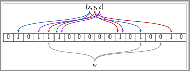

<table class="sphinxhide" width="100%">
 <tr width="100%">
    <td align="center"><h1>Vitis™ Hardware Acceleration Tutorials</h1>
    <a href="https://www.xilinx.com/products/design-tools/vitis.html">See Vitis™ Development Environment on xilinx.com</a>
    </td>
 </tr>
</table>

# Overview of the Original Application

Document filtering is the process in which a system monitors a stream of incoming documents, classifies them according to their content, and selects documents relevant to a specific user or topic. Document filtering is used extensively in the everyday querying, retrieval, and analysis of information that helps to identify relevant documents of interest.

In practical scenarios, the number of documents to search through for an event can be very large and because the monitoring of events must run in real-time, a smaller execution time is required for processing all the documents. In this tutorial, you compute a score for each document, which represents the document's relevance.

The user's interest is represented by a search array, which contains words of interest and has a weight associated with it, indicating the prominence of the word. While monitoring the incoming stream of documents, you want to find the weight associated with words stored in the database. A native implementation accesses the database for every word in the document to check if a word is present and if present, retrieve the weight of the word. A more optimized approach uses a space-efficient Bloom filter in your cache that can report whether a word is present in the database, which reduces the number of expensive database queries.

The Bloom filter uses a hash table-based data structure that determines when an element is present in the dataset. False-positive matches are possible, but false-negatives are not; in other words, a query returns either "possibly in a set" or "definitely not in set". The advantage of using a Bloom filter is that it is space efficient and reduces the number of database queries drastically for data that is not present in the database. A Bloom filter is also useful in applications to implement search engines and database management systems, such as Cassandra and Postgres, where it can reduce the number of disk queries and increases performance.

The following figure shows a Bloom filter example representing the set `{x, y, z}`.

* The colored arrows show the positions in the bit array that each set element is mapped to.
* The element `w` is not in the set `{x, y, z}` because it hashes to a one bit-array position containing 0.
* The number of elements are 18 and the number of hash functions computed for each element is 3.

## Tutorial Implementation

In this tutorial, each document consists of an array of words where: each word is a 32-bit unsigned integer comprised of a 24-bit word ID and an 8-bit integer representing the frequency. The search array consists of words of interest to the user, and represents a smaller set of 24-bit word IDs, where each word ID has a weight associated with it, determining the importance of the word.

1. Navigate to `Hardware_Acceleration/Design_Tutorials/02-bloom` directory.
2. Go to the `cpu_src` directory, open the `main.cpp` file, and look at line 63. 
  
    The Bloom filter application is 64 KB, which is implemented as `1L<<bloom_size` where `bloom_size` is defined as 14 in the header file `sizes.h` (calculated as `(2^14)*4B = 64 KB`).

    The score for each document is obtained by the cumulative product of multiplying the weight of word ID with its frequency. The greater the score, the more relevant the document that matches the search array.

## Next Steps

In the next step, you will [experience the acceleration potential](./2_experience-acceleration.md) before creating and optimizing a kernel.

<b><a href="./README.md">Return to Start of Tutorial</a></b>

Copyright © 2020–2023 Advanced Micro Devices, Inc

<a href="https://www.amd.com/en/corporate/copyright">Terms and Conditions</a>

