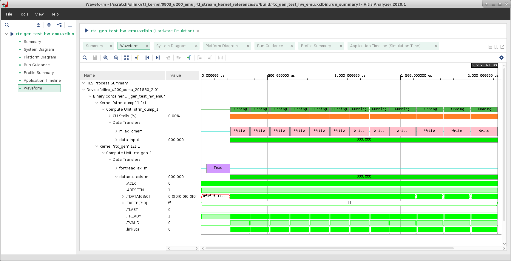

<table class="sphinxhide" width="100%">
 <tr>
   <td align="center"><h1>Vitis™ Application Acceleration Development Flow Tutorials</h1>
   </td>
 </tr>
 <tr>
 <td>
 </td>
 </tr>
</table>

# Hardware Emulation

There are three types of builds and runs in Vitis: Software Emulation, Hardware Emulation, and System Hardware. Because RTL kernels naturally do not support software emulation, this tutorial will only demonstrate the hardware emulation flow. 

In addition to functional correctness, hardware emulation provides a cycle-accurate performance and detailed resource estimates, but the compile and execution times are longer than for software emulation. It is recommended to use small data sets for validation during hardware emulation to keep run times manageable.

In the mix-kernel design, hardware emulation has often been used to test the system-level integration, and view the interaction between multiple kernels.

## Waveform Report

Vitis can generate a waveform view when running hardware emulation; it displays in-depth details include data transfers between the kernel and global memory and data flow through the inter-kernel pipes.

To enable waveform data collection, make sure the `-g` option was used during compilation, and the associated switch is turned on at the `xrt.ini` file, which should be placed at the same directory as the host executable file. A working `xrt.ini` is delivered with this tutorial; you can check it under *./sw/build/* directory. For more details, refer to [xrt.ini File](https://www.xilinx.com/html_docs/xilinx2020_1/vitis_doc/obl1532064985142.html) from the Vitis documentation.

```
[Emulation]
debug_mode=batch
```

Take the Hardware Emulation result of the *rtc_gen_test* on the U200 card as an example; a run summary file will be automatically generated after emulation has been successfully executed, and it can be opened directly with *Vitis Analyzer*. The waveform is included in the run summary report.

```
vitis_analyzer rtc_gen_test_hw_emu.xclbin.run_summary
```


You can also open the waveform database with the AMD Vivado™ logic simulator `xsim`.

```
xsim -gui xilinx_u200_xdma_201830_2-0-rtc_gen_test_hw_emu.wdb 
```

If you wish to have the simulation waveform opened during the hardware emulation run, change the debug_mode to GUI in the `xrt.ini` file.

```
[Emulation]
debug_mode=gui
```

Besides the waveform, other information delivered with the run summary is also valuable for you to profile, optimize, and debug your application. Refer to [Profiling the Application](./profile_tutorial.md) of this tutorial for more details. If you want to understand more detailed information about the hardware emulation flow, refer to [Hardware Emulation](https://www.xilinx.com/html_docs/xilinx2020_1/vitis_doc/buildtargets1.html#ldh1504034328524) from the Vitis documentation.

<p class="sphinxhide" align="center"><sub>Copyright © 2020–2023 Advanced Micro Devices, Inc</sub></p>

<p class="sphinxhide" align="center"><sup><a href="https://www.amd.com/en/corporate/copyright">Terms and Conditions</a></sup></p>
