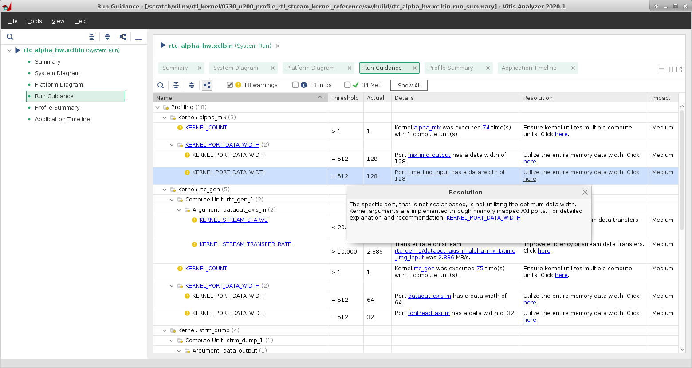
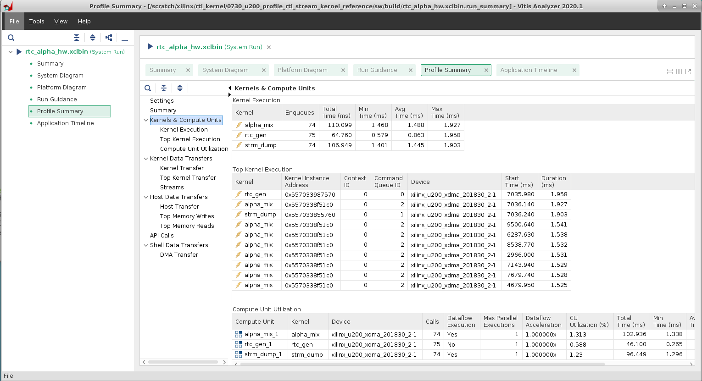
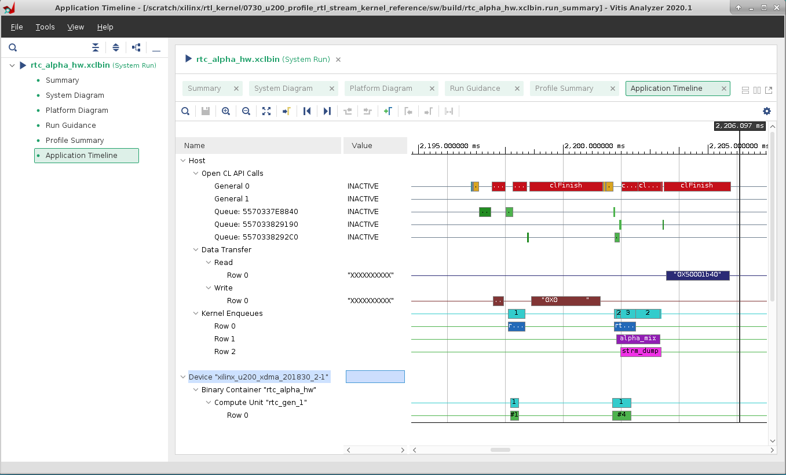

<table class="sphinxhide" width="100%">
 <tr>
   <td align="center"><h1>Vitis™ Application Acceleration Development Flow Tutorials</h1>
   </td>
 </tr>
 <tr>
 <td>
 </td>
 </tr>
</table>

# Profiling the Application

Vitis generates various system and kernel resource performance reports during compilation. XRT also collects profiling data during the application execution in both software and hardware emulation and system run mode. A run summary report linked to lots of reports from compilation and execution is automatically generated after running the active build and can be viewed in *Vitis Analyzer*.

Profiling reports and data can be used to isolate performance bottlenecks in the application, identify problems in the system, and optimize the design to improve performance. To obtain the profiling reports, make sure the associated switches are turned on in the `xrt.ini` file, which should be placed at the same directory as the host executable file. A working *xrt.ini* is delivered with this tutorial. You can check it under the `./sw/build/` directory. For more details, refer to the [xrt.ini File](https://www.xilinx.com/html_docs/xilinx2020_1/vitis_doc/obl1532064985142.html) from the Vitis documentation.

```
[Debug]
profile=true
timeline_trace=true
data_transfer_trace=fine
```

Take the Hardware Run result of *rtc_alpha_tb* on a U200 card as an example. There are reports of six categories listed with the run summary. The waveform will not be available because this is a run summary from the system run.

```
vitis_analyzer rtc_alpha_hw.xclbin.run_summary
```

## Run Guidance

Guidance includes a message for reported violations, a brief suggested resolution, and a detailed resolution provided as a web link. The rules are generic rules based on an extensive set of reference designs, thus might not be applicable for every design. You need to understand the specific guidance rules and take appropriate action based on your specific algorithm and requirements.



## Profile Summary

Enabling profile data capturing for traffic between the kernels and host consumes additional resources and can impact performance, so those elements were cleared out of the sources with the pre-built XCLBIN files with this tutorial.

You could add the `--profile_kernel` option during the Vitis compiler linking process to enable data profiling for kernels by adding Acceleration Monitors and AXI Performance Monitors to the kernels. See the following modification on `./hw/Makefile` as an example. A detailed description can be found in the [Vitis Compiler Command](https://www.xilinx.com/html_docs/xilinx2020_1/vitis_doc/vitiscommandcompiler.html#wrj1504034328013).

```
rtc_alpha_$(TARGET).xclbin: $(XOS_RTC_ALPHA)
	v++ -l $(XOCCFLAGS) $(XOCCLFLAGS) --config xclbin_rtc_alpha.ini --profile_kernel data:all:all:all  -o $@ $(XOS_RTC_ALPHA)

rtc_gen_test_$(TARGET).xclbin: $(XOS_RTC_GEN_TEST)
	v++ -l $(XOCCFLAGS) $(XOCCLFLAGS) --config xclbin_rtc_gen_test.ini --profile_kernel data:all:all:all  -o $@ $(XOS_RTC_GEN_TEST)
```



Even without the `--profile_kernel` option added while generating XCLBIN files, most of the profiling reports are still available, only few sections like the Kernel Data Transfers will show no data.


## Application Timeline

The Application Timeline collects and displays the host and kernel events on a common timeline;it helps to understand and visualize the overall health and performance of the systems. The graphical display makes it easy to discover issues regarding the kernel synchronization and efficient concurrent execution.



If you are looking for more details about profiling and how to use the *Vitis Analyzer*, refer to [Profiling the Application](https://www.xilinx.com/html_docs/xilinx2020_1/vitis_doc/profilingapplication.html). 

<p class="sphinxhide" align="center"><sub>Copyright © 2020–2023 Advanced Micro Devices, Inc</sub></p>

<p class="sphinxhide" align="center"><sup><a href="https://www.amd.com/en/corporate/copyright">Terms and Conditions</a></sup></p>
