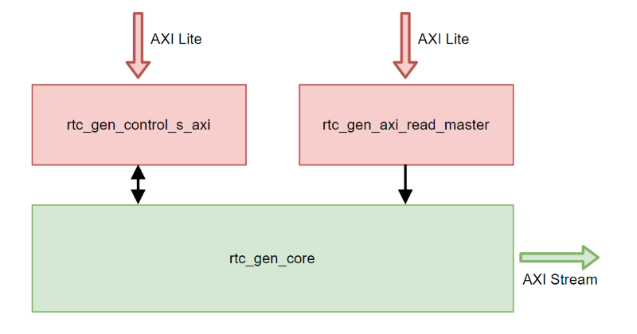
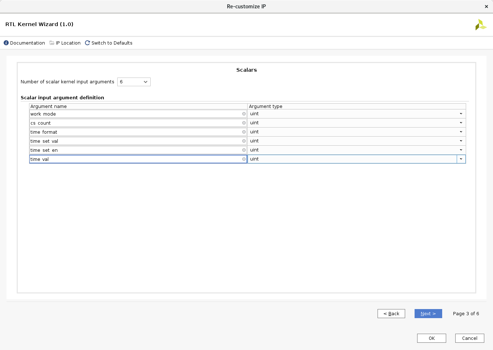
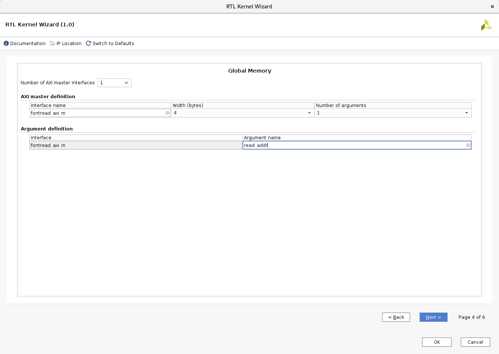
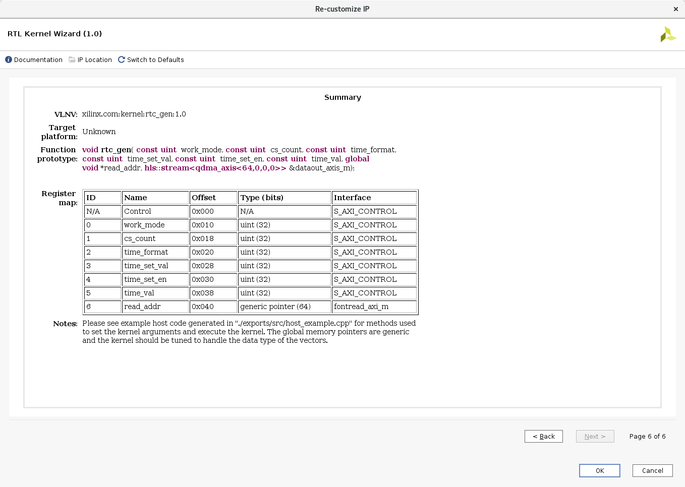
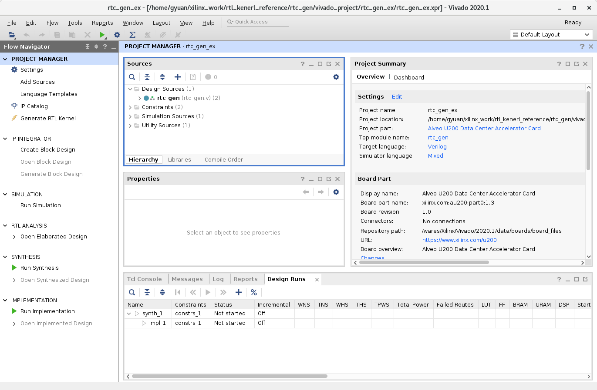

<table class="sphinxhide" width="100%">
 <tr>
   <td align="center"><h1>Vitis™ Application Acceleration Development Flow Tutorials</h1>
   </td>
 </tr>
 <tr>
 <td>
 </td>
 </tr>
</table>

# RTC_GEN RTL Kernel Creation

It is very easy for you to use the Vitis/Vivado RTL Kernel Wizard to create and develop a RTL-based kernel which could be seamlessly integrated with other HLS C or Vitis Vision library based kernels with Vitis. This tutorial will show the detailed steps to create the *rtc_gen* kernel. An AMD Alveo™ U200 is used as the target platform for this tutorial.

## Determine Top Level Design Specification

The *rtc_gen* kernel is required to read the font library from the global memory into the on-chip SRAM, then output the clock image via the AXI stream port. Considering the font library reading is a one-time job, and no global memory bandwidth requirement exists during normal work use a 32-bit (data bus) AXI4 master interface for the font reading port to save resources. In the downstream processing pipeline, you will use the *XF_NPP8* format (processing eight pixels in each clock cycle), so you select the AXI4-Stream width as 64-bit, which could transfer eight pixels in each AXI4-Stream transaction. For the control register, you will use an AXI slave interface compatible with XRT, so you could use the standard OpenCL API to program and control the kernel.

The top-level design specification for *rtc_gen* kernel is generalized as folows:

### Bus interfaces

+ AXI4-Lite slave interface for control
+ AXI4-Lite master interface for font data loading, data width 32-bit, address width 64-bit
+ AXI4-Stream master interface for clock digit image output, data width 64-bit

### Control RegisterD

|No.   | Arguments   | Width  | Description |
| ---- | ----        | ----   | ---- |
|0     | work_mode   | 1      |[0]: determine the kernel working mode   0 - load font from global memory to on-chip SRAM via AXI read master   1 - output RTC digit figure via AXI steam master |
|1     | cs_count    | 32     |[21:0]: Centi-second counter. For example, if the system clock is 200MHz, cs_count should be set to 2,000,000 |
|2     | time_format | 1      |[0]: determine whether centisecond is included in the output digit images   0 - disable centiseconds output   1 - enable centiseconds output |
|3     | time_set_val| 32     |Set time value for internal free-running clock:   [31:24] - hours   [23:16] - minutes   [15:8] - seconds   [7:0] - centi-seconds |
|4     | time_set_en | 1      |[0]: write 1 to this bit will load the time_set_value to internal free-running clock. |
|5     | time_val    | 32     |Read-only regsiter for internal real-time-clock time value:   [31:24] - hours   [23:16] - minutes   [15:8] - seconds   [7:0] - centi-seconds |
|6     | read_addr   | 64     |AXI master pointer, this is the FPGA device buffer address for font library |

## Use the RTL Kernel Wizard to Create the Kernel Frame

Now you use the RTL Kernel Wizard to create the frame for the *rtc_gen* kernel. You will launch the Wizard from the AMD Vivado™ Design Suite. Refer to [Vitis Application Acceleration Development Flow Documentation](https://www.xilinx.com/html_docs/xilinx2020_1/vitis_doc/devrtlkernel.html#qnk1504034323350) for a detailed user guide of the RTL kernel and RTL Kernel Wizard.

Change to the `./rtc_gen` directory of the git repo, create a directory named *vivado_project*, then enter this directory.

~~~
cd ./rtc_gen
mkdir vivado_project
cd ./vivado_project
vivado &
~~~

Create a new RTL project named *rtc_gen_kernel* in the just created *vivado_project* directory. During the part selection page, select **Alveo U200 Data Center Accelerator Card*.

When the project is created, in the Flow Navigator, click the IP catalog command, type RTL Kernel in the IP catalog search box, then double-click the RTL Kernel Wizard to launch the wizard.

In the *General Settings* tab of the RTL Kernel Wizard, set the kernel name to **rtc_gen**, set the kernel vendor to **xilinx.com**,and  change the *has reset* option to value 1.

In the *Scalars* tab, configure the kernel arguments per your design specification. Refer to the **Control Register** table and the following snapshot. Note the **read_addr** register is not considered a scalar argument as a AXI master pointer, so you do not need to configure it in this tab. You are using **uint** as the argument type here, though all these bits might not be used.

In the *Global Memory* tab, configure the AXI master interfaces parameters according to your design specification. Name the AXI master interface as **fontread_axi_m**, change the width to 4 bytes (32-bit), and set the related argument name to **read_addr**.

In the *Streaming interfaces* tab, set the number of AXI4-Sttream interfaces to 1, name it **dataout_axis_m**, set the mode the **Master**, and set the width to 8 bytes (64-bit).

Finally, review the summary page of the wizard, and click **OK** to generate the RTL kernel top-level framework.

For the next "Generate Output Products" pop-up window, just click **Skip** to close the window. Now you can see the `rtc_gen.xci` file in the *Design Sources* group of the *Sources* view. Right-click the `rtc_gen.xci` file, and select *Open IP Example Design*.

In the *Open IP Example Design* pop-up window, directly click **OK**, then another project named *rtc_gen_ex* will be created in the `./vivado_project` directory, and open automatically in another Vivado session. YOu will use the project, *rtc_gen_ex*, as the major working project to finish the *rtc_gen* kernel development.

In the *rtc_gen_ex* project, you can see a few automatically generated Verilog/SystemVerilog source code files:

~~~
rtc_gen_control_s_axi.v                 
rtc_gen_example_adder.v                
rtc_gen_example_axi_read_master.sv     
rtc_gen_example_axi_write_master.sv   
rtc_gen_example_counter.sv              
rtc_gen_example_number_generator.sv    
rtc_gen_example.sv 
rtc_gen_example_vadd_axis.sv
rtc_gen_example_vadd.sv
rtc_gen_tb.sv
rtc_gen.v
~~~

In the *Sources* view, *Hierarchy* tab, you can see the HDL file hierarchy. Now we have finished the kernel framework creation.

## RTC_GEN Kernel Development

You will use the following generated RTL files in your *rtc_gen* kernel:

+ **rtc_gen_control_s_axi.v**

  This is the AXI4-Lite slave interface to the upper-level system and XRT. It includes all the kernel arguments as well as the kernel control signals (`ap_start`, `ap_done`, `ap_idle`, and `ap_ready`). You will modify this module a little to realize the read-only register *time_val*.

+ **rtc_gen_example_axi_read_master.sv**
  
  It is a simple AXI4-Lite read master which could be called by your kernel directly. It uses four control signals to trigger the master to finish data reading tasks: 

  + *ctrl_start*: Single-cycle pulse to start the master state machine.
  + *ctrl_done*: Single-cycle pulse indicating the finish the AXI reading task.
  + *ctrl_addr_offset*: Base address for the AXI reading operation. The kernel argument *read_addr* can be used to drive this signal.
  + *ctrl_xfer_size_in_bytes*: Number of bytes to be read from the AXI bus.
  
  The example master also uses an AXI4-Stream port for reading the data transfer, which could be connected to a first in first out (FIFO)-like data pipeline easily.

+ **rtc_gen_example_counter.sv**
  
  The sub-module of the example AXI read master.

+ **rtc_gen.v**
  It is the example top-level kernel wrapper instantiating all the submodules. You will modify this module to construct your *rtc_gen* kernel.

+ **rt_gen_tb.sv**
  It is an example testbench using the AMD AXI Verification IP. You can modify this testbench to test your *rtc_gen* kernel.

In addition to these five files, you could also refer to the `rtc_gen_example_vadd.sv` for the connection of the AXI read master. For the AXI4-Stream port, it is simple, and you do not need the example for reference. For the *rtc_gen* kernel, a Verilog file, `rtc_gen_core.v`, is created to finish the core function of the kernel. The function diagram of *rtc_gen_core* is shown in the following diagram.

To make the core source code directory, clean all the necessary generated, newly composed, or modified RTL files placed in the `~/rtc_gen/src` directory. Review the directory for these source code files. Note `SPSR.v` is a parameterized SRAM template which could be synthesized to the FPGA block RAM.

~~~
./rtc_gen/src/rtc_gen_control_s_axi.v
./rtc_gen/src/rtc_gen_core.v
./rtc_gen/src/rtc_gen_example_axi_read_master.sv
./rtc_gen/src/rtc_gen_example_counter.sv
./rtc_gen/src/rtc_gen_tb.sv
./rtc_gen/src/rtc_gen.v
./rtc_gen/src/SPSR.v
~~~

Now remove all the existing Verilog/SystemVerilog source codes (except for thos in the *IP* group) from the *rtc_gen_ex* project in Vivado, then add the files in `./rtc_gen/src` to the project (`rtc_gen_tb.sv` for *Simulation-Only Sources*, other files for *Design Sources*). Thus you can see the design hierarchy in the following snapshot, and you finish the coding for kernel *rtc_gen*.

Now you can simulate the design and go through the normal RTL design flow with the standard Vivado design methodology. A text format font library file `font_sim_data.txt` in the `./rtc_gen` directory is provided, which could be read in by testbench `rtc_gen_tb.sv` for simulation. Copy it to `./rtc_gen/vivado_project/rtc_gen_ex/rtc_gen_ex.sim/sim_1/behav/xsim/` for simulation runs.

## Package the RTL Kernel

After you confirm the design is OK, select **Generate RTL Kernel** from the *Flow* menu, then select **Sources-only kernel** in the pop-up window, and click **OK** to finish the *rtc_gen* RTL kernel creation.

The generated kernel file is `./rtc_gen/vivado_project/rtc_gen_ex/rtc_gen.xo`, which can be used in the downstream Vitis integration flow. From the Vivado *Tcl Console* view, you can see the Vivado actually uses the following command line to finish the kernel packaging:

~~~
package_xo  -xo_path ./rtc_gen/vivado_project/rtc_gen_ex/exports/rtc_gen.xo \
            -kernel_name rtc_gen \
            -ip_directory ./rtc_gen/vivado_project/rtc_gen_ex/rtc_gen \
            -kernel_xml ./rtc_gen/vivado_project/rtc_gen_ex/imports/kernel.xml
~~~

`./rtc_gen/vivado_project/rtc_gen_ex/rtc_gen` is the folder for the *rtc_gen* IP, and `./rtc_gen/vivado_project/rtc_gen_ex/imports/kernel.xml` is the kernel description file. You could copy out these items to a standalone directory and just use the command line above to package the kernel. This is also where the `./hw/rtc_gen_ip` directory and `./hw/rtc_gen_kernel.xml` file comes from.

Copyright © 2020–2023 Advanced Micro Devices, Inc

<a href="https://www.amd.com/en/corporate/copyright">Terms and Conditions</a>

