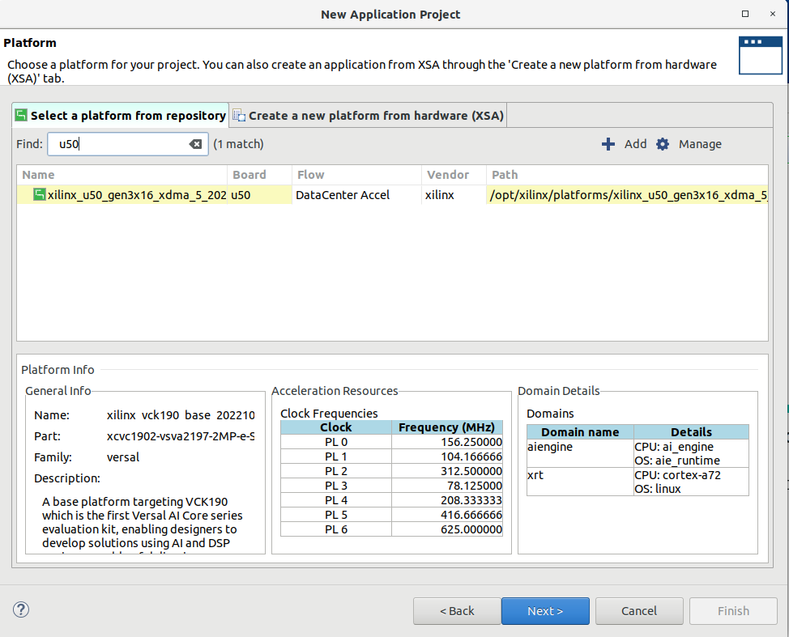
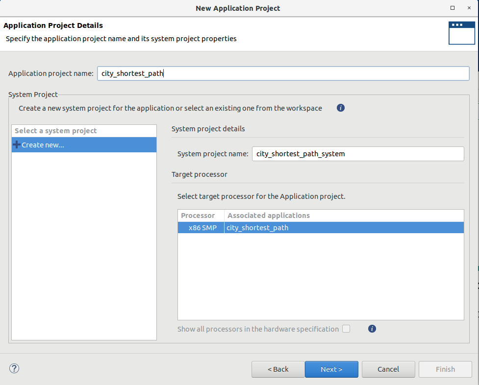
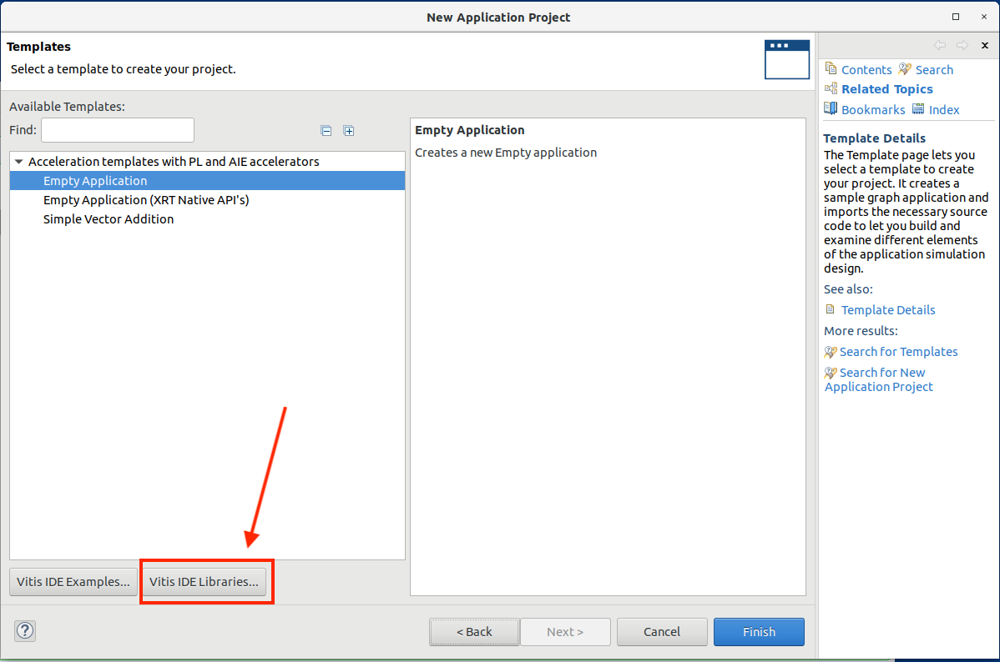
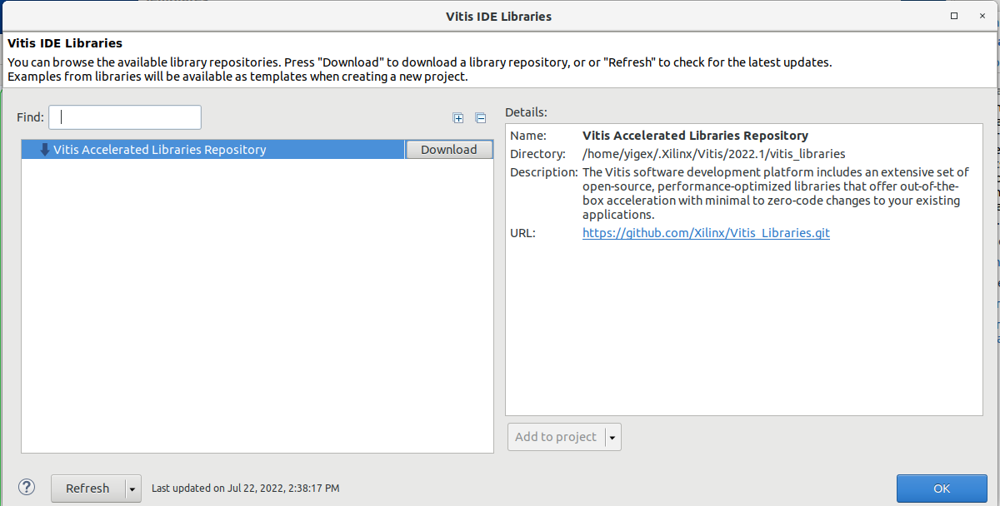
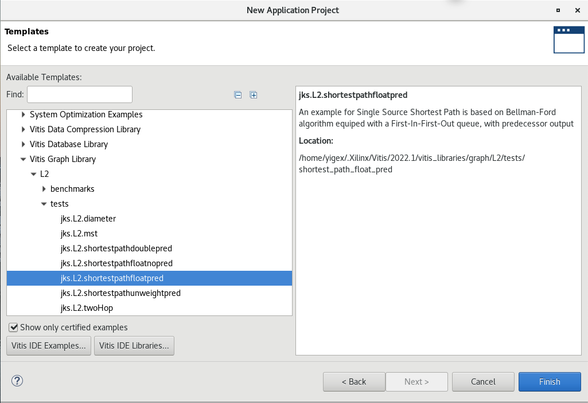
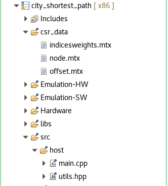

<table width="100%">
 <tr width="100%">
    <td align="center"><h1>Vitis™ Hardware Acceleration Tutorials</h1>
    <a href="https://www.xilinx.com/products/design-tools/vitis.html">See Vitis™ Development Environment on xilinx.com</a>
    </td>
 </tr>
</table>

# Part 4: Using the Vitis GUI to Create an Application

The following flow demonstrates how to create an application with the Vitis GUI.

## Create a Project with Vitis Libraries

Follow these steps to create a project with Vitis Libraries.

1. After setting the workspace directory, choose **Create Application Project**.

    

2. Select U50 as the platform and click **Next**.

    

3. Create your application name and click **Next**.

    

4. Choose the Vitis IDE libraries and download them.

    

    

5. After downloading the Vitis Libraries, choose the SSSP in Graph Lib.

    

## Build your Application

1. Import your kernels to the ```kernel``` directory.

    

2. Modify the data set in ```data``` and import your main code to the ```main``` directory.

    


## Debug

After building the project, click **Debug** into the main function.


## Next

[**Summary**](../../README.md#Summary).


<p class="sphinxhide" align="center"><sub>Copyright © 2020–2023 Advanced Micro Devices, Inc</sub></p>

<p class="sphinxhide" align="center"><sup><a href="https://www.amd.com/en/corporate/copyright">Terms and Conditions</a></sup></p>
