<table>
 <tr>
   <td align="center"><h1>2020.2 Vitis™ Application Acceleration Tutorials</h1>
   <a href="https://github.com/Xilinx/Vitis-Tutorials/branches/all">See 2020.2 Vitis Application Acceleration Development Flow Tutorials</a>
  </td>
 </tr>
 <tr>
 <td align="center"><h1>Vitis HLS Analysis and Optimization</h1>
 </td>
 </tr>
</table>

# FIFO Sizing for Performance and avoiding Deadlocks

Due to the dynamic nature of the dataflow optimization, and the propensity of different parallel tasks to execute at different rates, it is possible that poorly sized dataflow channels can cause loss of performance and/or deadlock. There are different types of dataflow channels - some are created by the user while some are created by the tool.

## Types of channels

| Channel Type    | Examples | Created By |
| :-------------: |:-------------| :----:|
| FIFO            | Streams (including hls::streams and streamed arrays) | User |
|                 | Scalar propagation FIFOs | Tool |
|                 | Streams of blocks | User |

These FIFO channels should be thought of as "channels with their own handshake", because:

* Their read and write operations are scheduled,
* Their read/write signals are driven individually by the pipeline control or the FSM
* Their full_n/empty_n signals directly stall individual iterations of a pipeline or states of the FSM.

| Channel Type        | Examples    | Created By |
| :---------------:   |-------------| :-------: |
| PIPO                | PIPO        | User |
|                     | Task Level FIFOs (TLF)  | Tool |
|                     | Input and output ports to the upper level  | User |

Task Level FIFOs (TLF) are scalar FIFOs which are connected to the done handshake of the producer for writing, and to the start handshake of the consumer for reading. These types of FIFOs are inferred automatically by the tool. They are considered PIPO-like because of the underlying synchronization mechanism. 

These channels should be thought of as "channels that use ap_ctrl_chain handshake", because:

* Their write and read operations are not scheduled. They are implicitly associated with the "done" handshake or the "start" handshake of a process
* Their write and read signals are connected to ap_done and ap_ready respectively
* Their full_n and empty_n are connected to ap_continue and ap_start respectively

What really matters with respect to the analysis of depth, performance, deadlocks etc., is whether:

* Channels have their own handshake (FIFOs). Hence their accesses are _spread_ throughout the execution of their process. For example, you can read a FIFO outside the first II of a pipeline, or even in the last process of a dataflow network.
* Channels are hand-shaken via ap_ctrl_chain (PIPOs). Hence their reads must be in the first initiation interval (II) of the pipeline or in processes that are in the first "level" of a dataflow network, and similarly their writes must be in the last II or in the last "level."
* The other difference is based on the amount of data that is being transferred in one operation is more relevant for resource analysis than for performance: array for PIPOs and streams of blocks, scalar for streams, scalar propagation FIFOs and task level FIFOs.

## Deadlock Detection and Analysis

Insufficiently sized FIFOs (and PIPOs) in dataflow can cause deadlocks. Consider the following diagram:


* Case 1: 
   * Producer alternately writes to FIFO1, FIFO2, FIFO1, FIFO2, and so on.
   * Consumer alternately reads from FIFO1, FIFO2, FIFO1, FIFO2, and so on.
   * A depth of 1 for both FIFOs is enough to avoid deadlocks (and the default depth of 2 optimizes for performance).

* Case 2 (same structure):
   * Producer writes to FIFO1 for N times, then to FIFO2 for N times 
   * Consumer alternately reads from FIFO1, FIFO2, FIFO1, FIFO2, and so on. 
   * A depth of N is necessary for FIFO1 (and the default depth of 2 for FIFO2 is optimal for performance)

As you can see from the above two simple cases, for exactly the same structure of code, depending on how the FIFO channels are accessed, the FIFO depths may need to be set differently. FIFO depths are used to amortize and match the _burst behavior_ of FIFO accesses.

Compiler-created FIFOs and PIPOs (from scalars or arrays between processes) should never cause deadlocks. But their depths might be insufficient for optimal performance. User created FIFOs (from hls::streams and hls::stream_of_blocks between processes) may cause both deadlocks and/or low performance depending on their depths.

>**TIP:** Deadlocks due to insufficient FIFO depths always exhibit at least one blocked writer. If not, it is most likely a design issue - typically due to non-blocking reads or writes, or reads and writes conditioned by empty() and full().

The goal of this tutorial is to help you analyze a dataflow design and identify its bottlenecks, which may be:

1. Processes or regions which have a larger II than the rest, and thus can constrain the overall throughput. This issue can be fixed by:
   * Reducing the II for such processes
   * Investigating dataflow regions and to "dig" inside them to discover the reason (which may be any one of these three).
2. FIFOs (channels with their own handshake: which includes streams, streams of blocks, streamed arrays) or PIPOs (channels without their own handshake: includes PIPOs and TLFs) that have a depth that is too small, and thus can become full. This issue can be fixed by increasing the depth of the channel. A following section will describe how to do this.
3. Top-level synchronization (scalar or external memory inputs from above or outputs to the calling context, synchronized via ap_ctrl_chain or ap_ctrl_hs of the region). In this case the remedy is to manually copy these variables and pass them through the network of processes to avoid the loss of performance. 

Note that for complex designs, with data-dependent synchronizations (e.g. a process reads 128 times from a FIFO in one execution, and 32 times in another), a process may block for a variety of reasons, that change over time. In this case, the Dataflow co-simulation waveforms may be the only viable approach for debugging - as described in the earlier lab.

As the second exercise in this tutorial, you will first synthesize the example design and bring up the dataflow viewer to show how a deadlock can be investigated and resolved. In this lab, you will look at a simple [deadlock example](./reference-files/src/deadlock/example.cpp), found in the `reference-files/deadlock` folder.

In this lab, you will:

1. Understand how to use the different features of the dataflow viewer to investigate a deadlock.
2. Use the FIFO sizing features to resolve the deadlock and improve performance.

## Second Lab

1. Change directory to the `03-dataflow_debug_and_optimization/reference-files/deadlock` directory, and launch the Vitis HLS tool by issuing the following command:

```C++
vitis_hls -p script.tcl
```

The Vitis HLS GUI will launch and create the project needed to synthesize the design but the GUI will stop short of executing the commands in the `script.tcl` file.

* Click the dropdown menu next to the green **Run** command () and select `C Simulation` (as shown below) and click `OK` in the `C Simulation Dialog` box to run simulation. 

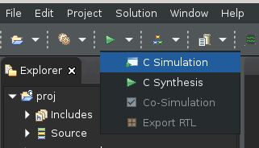

* Click on the green **Run** command () to synthesize the design.  

* Click the dropdown menu next to the green **Run** command () and select  `Co-simulation` link and then select the `Channel (PIPO/FIFO) Profiling` option before clicking `OK` in the window that pops up to run the C/RTL cosimulation. The GUI will automatically launch the Dataflow Viewer as a deadlock is detected in this design (as shown in the following figure).

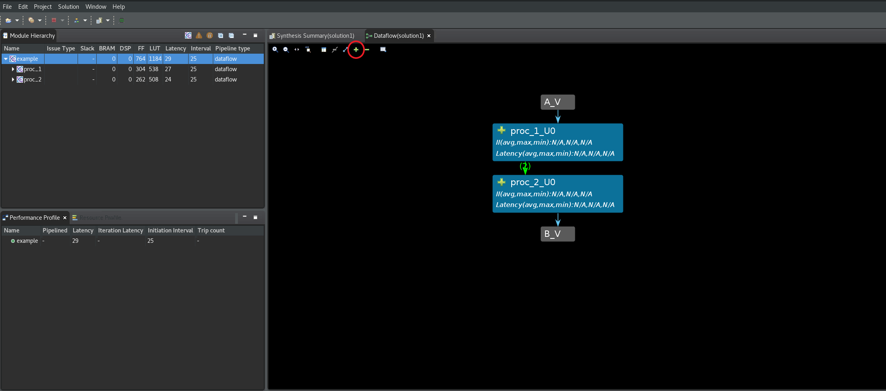

* Click on the green `+` command in the Dataflow Graph toolbar menu to expand all channels and sub-processes in the design. Processes that are deadlocked will be shown in red in the graph (as shown below). Channels that are full are displayed with red arrows in the graph, and channels that are empty are displayed with white arrows in the graph. The Channel table will additionally highlight the depth of full or empty channels in red.
* Using both the `Cosim Max Depth` column and the `Depth` column, you can see that the first channel that you must resize is the **data_channel1** that is between producer **proc_1_1_U0** and consumer **proc_1_2_U0** processes (as shown in the `Producer` and `Consumer` columns).


There are three ways to do this FIFO sizing, and this lab will walk through each one in turn:

* Manual FIFO sizing
* Global FIFO sizing
* Automated FIFO sizing

### Manual FIFO Sizing

Performance losses due to insufficient FIFO or PIPO depth always cause at least one process to block on a full FIFO. Determining the right size for the FIFO depth is generally an unsolvable problem. Fortunately, RTL co-simulation also reports the maximum depth achieved for each channel so that even if you assign an arbitrarily large depth for the FIFO, you can always resize it to the max depth achieved. Additionally, increasing FIFO or PIPO depths never reduces performance, it simply consumes additional resources.


As discussed, you must resize **data_channel1** that is between producer **proc_1_1_U0** and consumer **proc_1_2_U0** processes. In order to resize the blocked FIFO, follow these steps:

* As the above figure shows, right-click on the highlighted **data_channel1** row and select the `Modify Depth` option. This displays the **Modify Depth** dialog box as shown below.

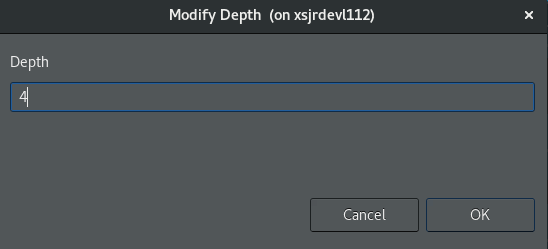

* Set the new depth as 4 (double of 2) and click the `OK` button. 
* The GUI will ask you if you want to rerun the cosimulation. Click the `No` button as we are not done with modifying FIFO depths.
* Repeat this for **data_channel2** which was also part of the deadlock. 
* The GUI will ask you if you want to rerun the cosimulation. Click the `Yes` button, and then select the `Channel (PIPO/FIFO) Profiling` option before clicking `OK` to launch co-simulation.
* The C/RTL co-simulation is run again and reports that the design is still deadlocked (as shown below)

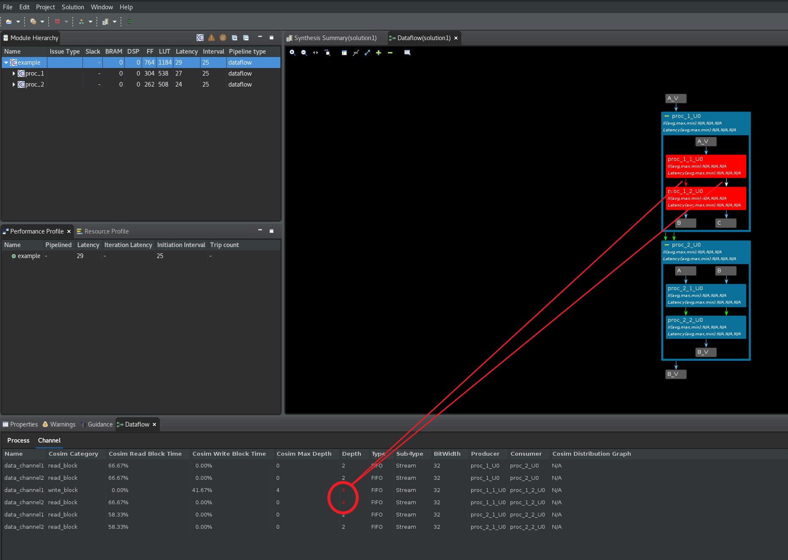

* Now repeat the above steps and increase the depth of **data_channel1** and **data_channel2** to 10. Rerun C/RTL co-simulation and observe that the deadlock is no longer on these channels (now highlighted in green) but has now moved to the channels between process **proc_1_U0** and **proc_2_U0** (as shown below).

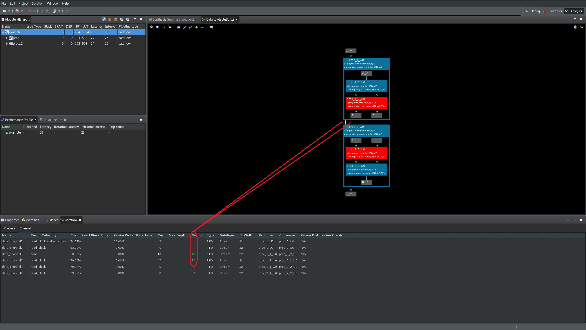

* Repeat the FIFO resizing steps on these channels and set the new depth to 10 and then rerun the C/RTL co-simulation. Notice that the deadlock has now moved to channels between process **proc_2_1_U0** and **proc_2_2_U0** (as shown below).

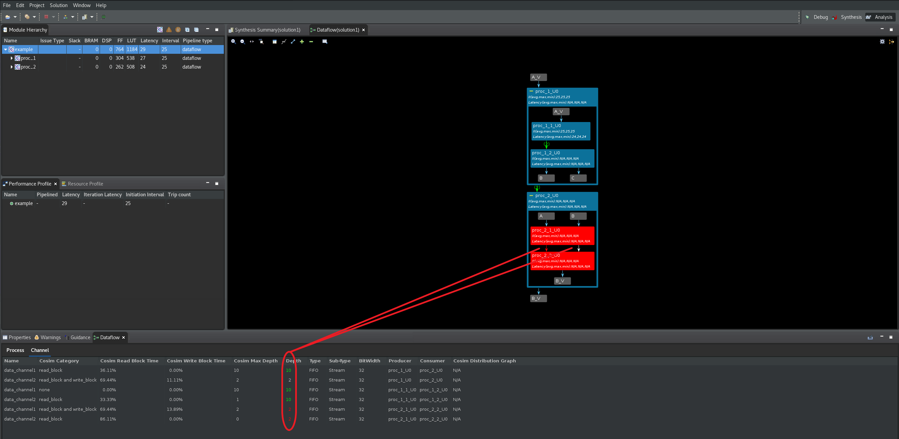

* Repeat the FIFO resizing steps on these channels and set the new depth to 10 and then rerun the C/RTL co-simulation. Notice that the deadlock is now resolved (as shown below). 
  
**TIP:** The Dataflow Graph may not be displayed automatically, because the deadlock issue has been resolved. You might have to manually open the Dataflow Graph viewer.

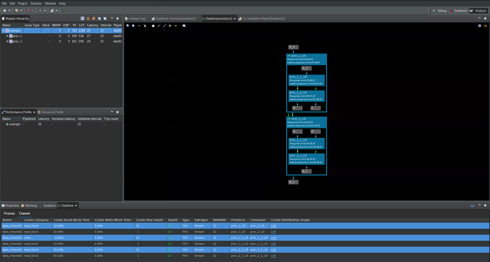

In the above figure, note that only three of the channels actually require a depth of 10. This can be seen by comparing the `Cosim Max Depth` and `Depth` columns. The other channels are fine with the default depths and dont require the increased depth value. 

**IMPORTANT:** While the deadlock has been resolved the new FIFO depths that helped resolve the issue have not been back-annotated to the source code. If you quit the Vitis HLS GUI at this point, you will loose these depth settings. Note that if you do choose to back-annotate these new depths to the source code, you will have to undo them later when you proceed to the next phase of the tutorial. 

* To back-annotate your solution to the source code, select all the channels that need the new depth setting (by pressing Ctrl and selecting the channel with a mouse click) and select the `Back Annotate the New Depth into the Design` option as shown below and click `Next`.

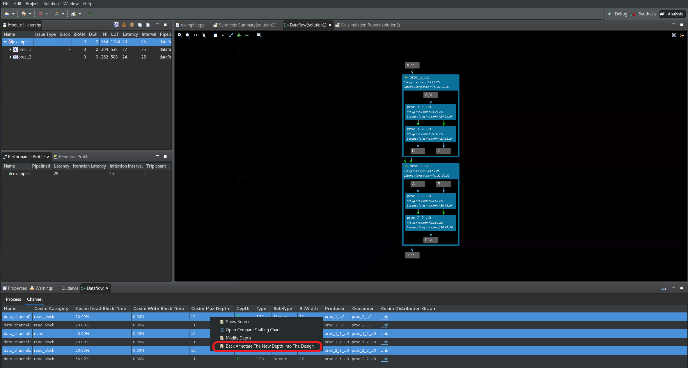
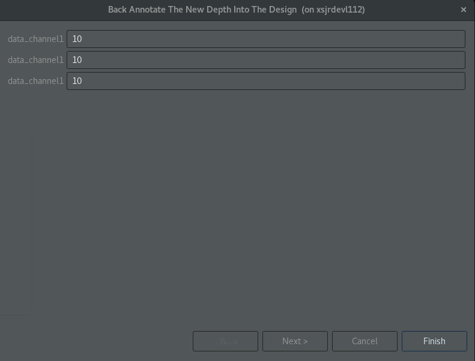


* A new window will pop up and show the change in the form of a pragma that will be inserted in the design's source code. Note that this new pragma setting will contain a comment stating that this pragma was inserted by Vitis HLS (as shown below).

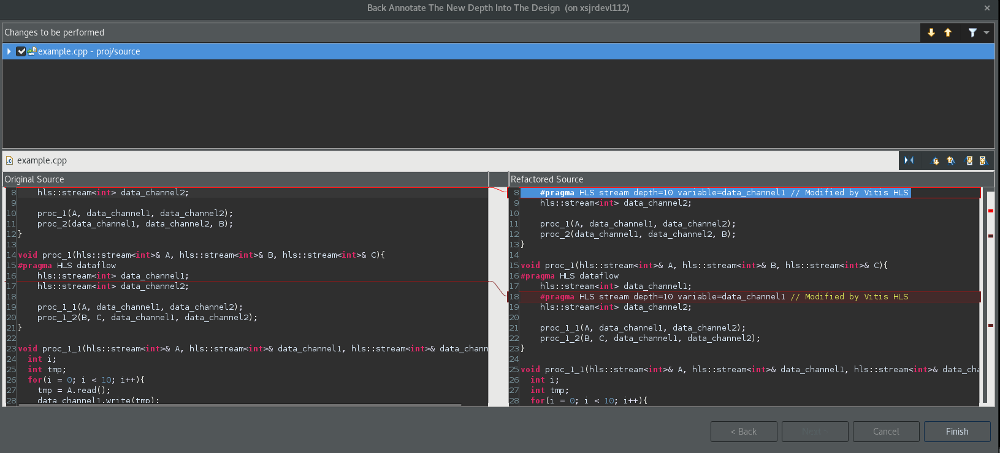

After each such back-annotation step, the GUI will ask if you want to resynthesize the design (since new pragmas have been added). Click `Yes` to resynthesize the design. Next, click the dropdown menu next to the green **Run** command () and select  `Co-simulation` link and then select the `Channel (PIPO/FIFO) Profiling` option before clicking `OK` in the window that pops up to run the C/RTL cosimulation. Confirm that the new pragma settings resolve the deadlock.

**IMPORTANT**: Before proceeding to the next step in the tutorial, it is important to undo the above annotation step. Double click on `example.cpp` in the `Explorer` tab (as shown below) and select the `Directives` tab on the far right. This tab will show the new pragmas that were added in the last step. Right click on each pragma and select `Remove Directive` to remove it from the source file. 

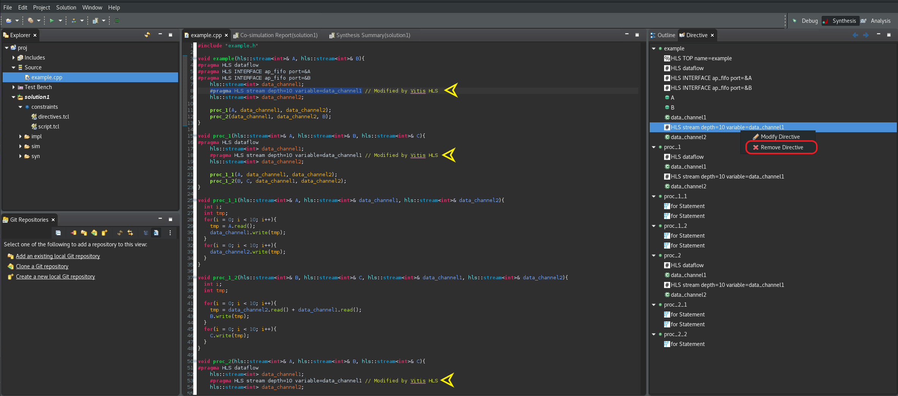

### Global FIFO Sizing

In order to use the Global FIFO sizing flow, it will require you to restart from the beginning. Exit the Vitis HLS GUI and restart it by executing the following at the command line:

```C++
vitis_hls -p script.tcl
```

Next follow these steps:

1. Click on the drop down arrow next to the green run icon  and select `C Simulation` and then click `OK` in the popped up window.
2. Verify that csim completes successfully and without warnings
    * Watch for and write down the maximum depth of any hls::stream printed out by the C simulator to the console, e.g.

  ```C++
   The maximum depth reached by any of the 26 hls::stream() instances in the design is 40 
  ```

3. Force the depth of all FIFOs to be the max value reported by C simulation. You can do this by clicking the `Solution` link in the top menu and selecting `Solution Settings` (as shown below)

   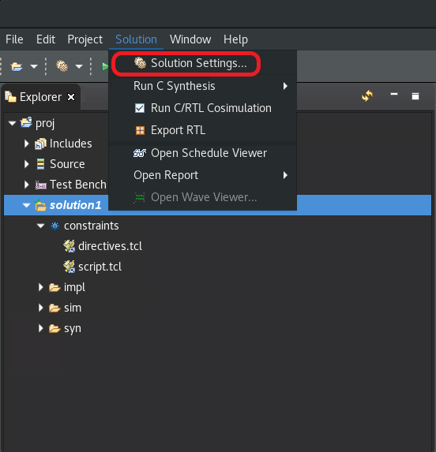

4. In the `Solution Settings` window, under `General`, scroll to find `config_dataflow` in the Configuration Settings (as shown below), select the `override_user_fifo_depth` setting and set the value to 40. Click `OK` to set this new configuration setting.

     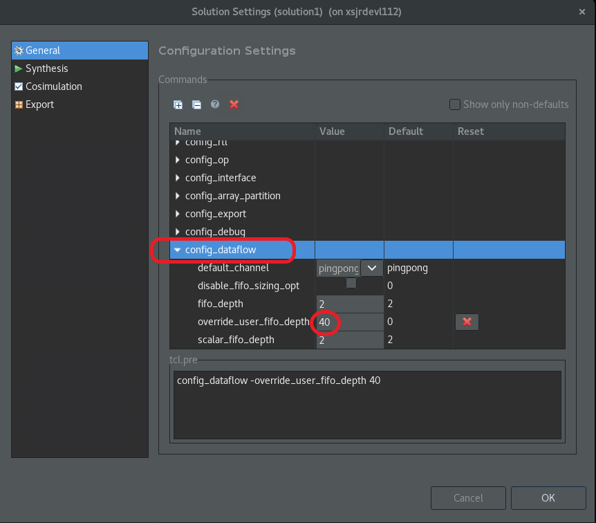

5. Click on the green **Run** command () to rerun C Synthesis.

6. Rerun C/RTL Cosimulation by selecting `Co-Simulation` from the drop down menu next to the green **Run** command (). Click `OK` in the window that pops open.

7. This time, no deadlock will be observed and C/RTL co-simulation finishes without error.

8. Go to the `Co-simulation Report` and right click on the top function that has the dataflow icon next to it and select `Open Dataflow Viewer` to relaunch the Dataflow viewer.

9. Now look at the channel table in the Dataflow viewer and compare the depths in the `Cosim Max Depth` and `Depth` columns. The correct depths can be observed in the `Cosim Max Depth` column (as seen below). This is the needed depths for all the FIFOs in this design.

   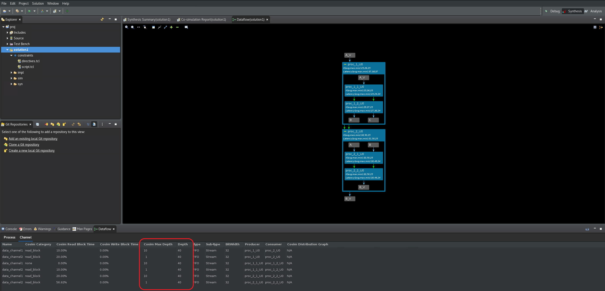

10. You can now manually back-annotate the observed `Cosim Max Depth` as pragma settings in the source code.

### Automated FIFO Sizing

Of the three approaches, the automatic FIFO sizing is the easiest but:

* It requires repeated cosimulation runs and so may take a while to converge.
* It is a heuristic algorithm, and in some cases it may never converge.

The algorithm automatically increases the depth of FIFOs that block writers until performance no longer increases. It may increase some FIFO depths beyond what is reasonable and will require user inspection.

In order to use the Automated FIFO sizing flow, it will require you to restart from the beginning. Exit the Vitis HLS GUI and restart it by executing the following at the command line:

```C++
vitis_hls -p script.tcl
```

Next follow these steps:

To turn on the automated FIFO sizing: 
   
1. Click on the green **Run** command () to rerun C Synthesis.
2. Run C/RTL Co-simulation by selecting `Co-Simulation` from the dropdown menu next to the green **Run** command (). 
3. Select the `Dynamic Deadlock Prevention` option in the `Co-simulation Dialog` (as shown below). Click `OK` to start the C/RTL co-simulation.

   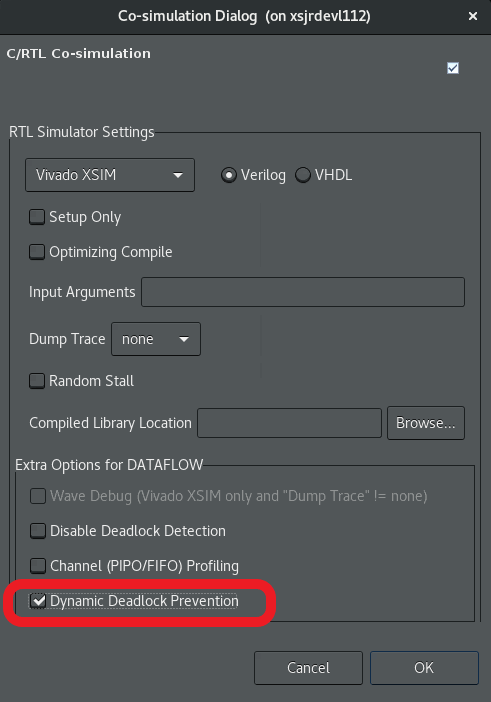

3. The C/RTL Co-simulation will run for a while attempting to find the right FIFO sizes for the channels that cause the deadlock. After some time, it will stop when the co-simulation successfully completes. 
4. Relaunch the Dataflow Viewer to see a new `FIFO Sizing` table along side the Process and Channel tables. This new tables documents the new FIFO sizes determined by the algorithm.
5. You can manually back-annotate these FIFO sizes in the source code using pragmas or directives.  

  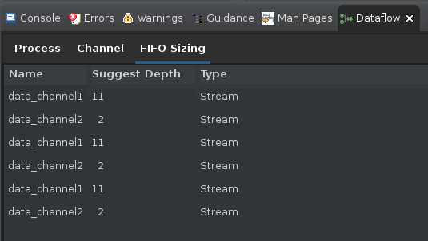

## Takeaways

In summary, the Dataflow viewer enables the following throughput analysis tasks:

   * The graph shows the overall topology of the DATAFLOW region and shows what type of channels (FIFO/PIPO) were inferred for communication between the tasks in the DATAFLOW region. Analyzing each channel and process can be useful to resolve issues such as deadlock or poor throughput because of bad FIFO sizing. 
   
   * The co-simulation data helps with the FIFO sizing problem by tracking the maximum size of the FIFO during the course of the simulation and thereby giving the user a good reference point on how to size the FIFOs. In addition, when running cosimulation, automatic deadlock detection can highlight the processes and channels involved in the deadlock allowing the user to quickly narrow the focus and fix the issue.

   * In addition to FIFO sizing, the data reported after cosimulation also provides, on a per process and channel basis, the time spent stalling either waiting for input or blocked from writing output. The graph helps the user understand such issues and manage how the channels are sized to accommodate slow producers versus fast consumers and/or vice-versa. In addition, the graph is useful in understanding how reading from the input in the middle of a DATAFLOW region can impact performance. This is a fairly common scenario where performance can be impacted.
</br>
<hr/>
<p align="center"><b><a href="/docs/vitis-getting-started/">Return to Getting Started Pathway</a> — <a href="./README.md">Return to Start of Tutorial</a></b></p>

<p align="center"><sup>Copyright&copy; 2021 Xilinx</sup></p>