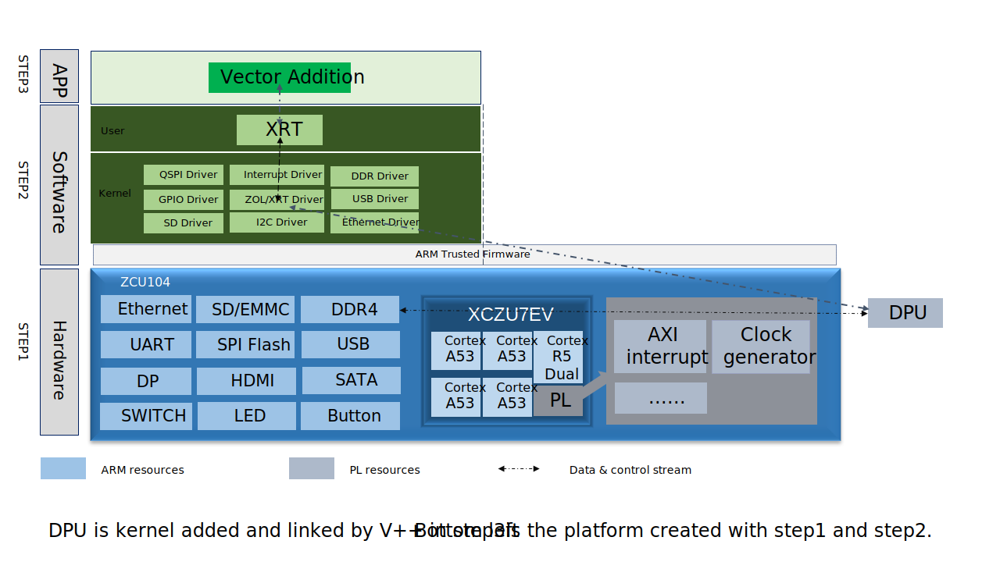

<!--
# Copyright 2020 Xilinx Inc.
#
# Licensed under the Apache License, Version 2.0 (the "License");
# you may not use this file except in compliance with the License.
# You may obtain a copy of the License at
#
#     http://www.apache.org/licenses/LICENSE-2.0
#
# Unless required by applicable law or agreed to in writing, software
# distributed under the License is distributed on an "AS IS" BASIS,
# WITHOUT WARRANTIES OR CONDITIONS OF ANY KIND, either express or implied.
# See the License for the specific language governing permissions and
# limitations under the License.
-->

<table class="sphinxhide" width="100%">
 <tr width="100%">
    <td align="center"><h1>Vitis™ Platform Creation Tutorials</h1>
    <a href="https://www.xilinx.com/products/design-tools/vitis.html">See Vitis™ Development Environment on xilinx.com </a>
    </td>
 </tr>
</table>

# Vitis Custom Embedded Platform Creation Example on ZCU104

***Version: Vitis 2022.2 Vivado 2022.2***

**Note**: **Vitis-AI for Vitis 2022.2** is not available for the moment. Vitis-AI application will be updated soon after Vitis-AI for Vitis 2022.2 released.

In this module, we will create a custom Vitis embedded platform for ZCU104. It will be capable to run ***Vitis acceleration applications*** including ***Vitis-AI applications***. Of course, general ***embedded software application*** can also run on this platform. This example system total structure is like below for your reference.
 
  

Since ZCU104 is a validated Xilinx Evaluation Board and Vivado includes its processing system presets, we will skip to validate the board and start to build the full hardware and generate XSA.

To prepare the software components, we will utilize the common image and create the DTB file according to the XSA file exported from step1. Then we'll package the platform. At last, we'll run several test applications including Vitis-AI application on this platform to test this customized platform.

## Custom Platform Planning

The platform we create should be able to run these applications finally

- Vitis acceleration examples like Vector Addition
- Vitis-AI applications

Vadd application requires 1x clock, 1x interrupt, 1x M_AXI for kernel control and 1x S_AXI for memory access.

Vitis-AI application would integrate DPU as RTL kernel. It would require two clocks: clk and clk2x. We can give 200MHz and 400MHz clocks for easy timing closure. One interrupt is needed as well. DPU is a memory hungry IP so the platform needs to provide multiple AXI HP interfaces.

On the software side, the platform needs to provide the XRT, ZOCL packages. Host application can use XRT OpenCL API to control Kernel. Vitis-AI software framework can control DPU with XRT. ZOCL is the kernel module that talks to acceleration kernels. It needs a device tree node so it will be added. Other Vitis-AI dependencies will also be added. Common image provided by Xilinx can accomplish all these features. Besides these common features, we wish to add GCC compilers to do application native compilation, add mesa-mega driver for Vitis-AI demo applications and replace the dropbear with openssh so that the network speed can be faster.

## Step-by-Step Tutorial

We'll introduce the platform creation steps in the following pages. Each page describes one major step in the platform creation process.

- [Step 1: Create the Hardware Platform](./step1.md) 
            Utilize Vivado to generate XSA file  which contains hardware information of our platform
- [Step 2: Create the Vitis Software Platform](./step2.md) 
            Prepare software components and create Vitis platform
- [Step 3: Create Vitis Application](./step3.md) 
            Create simple application to validate our Vitis Platform

***Let's start from [step 1: Create the Hardware Platform](./step1.md).***

## Change Log
### 2022.2
- `createdts` add user's device tree file support

### 2022.1
- From this version we begin to use pre-built Linux common image instead of building Linux components with PetaLinux because the pre-built common image provides most common features for Vitis acceleration and it can help expedite the platform creation process. If you wish to leverage the PetaLinux tool to customize your system you can refer to the [PetaLinux Customization Tutorial](../../Feature_Tutorials/02_petalinux_customization/README.md).
- Simplify the device tree generation flow by using the newly introduced `createdts` XSCT command.

### 2021.2
- The Vivado project exports XSA for hardware and hardware emulation separately. When creating the platform in [step3](./step3.md), it's recommended to provide separate XSA for hardware and hardware emulation.

## References

- [UG1393: Vitis Acceleration Flow User Guide](https://docs.xilinx.com/r/en-US/ug1393-vitis-application-acceleration)
  - [Platform Creation General Rules](https://docs.xilinx.com/r/en-US/ug1393-vitis-application-acceleration/Creating-Embedded-Platforms-in-Vitis)
  - [Setting up the Vitis environment](https://docs.xilinx.com/r/en-US/ug1393-vitis-application-acceleration/Setting-Up-the-Environment-to-Run-the-Vitis-Software-Platform)
- Platform Examples
  - [zcu102](https://github.com/Xilinx/Vitis_Embedded_Platform_Source/tree/2022.2/Xilinx_Official_Platforms/xilinx_zcu102_base) and [zcu104](https://github.com/Xilinx/Vitis_Embedded_Platform_Source/tree/2022.2/Xilinx_Official_Platforms/xilinx_zcu104_base) base platform source code in [Vitis Embedded Platform Source Github Repository](https://github.com/Xilinx/Vitis_Embedded_Platform_Source)
- [Vitis-AI Github Repository](https://github.com/Xilinx/Vitis-AI)

Copyright&copy; 2022 Xilinx

