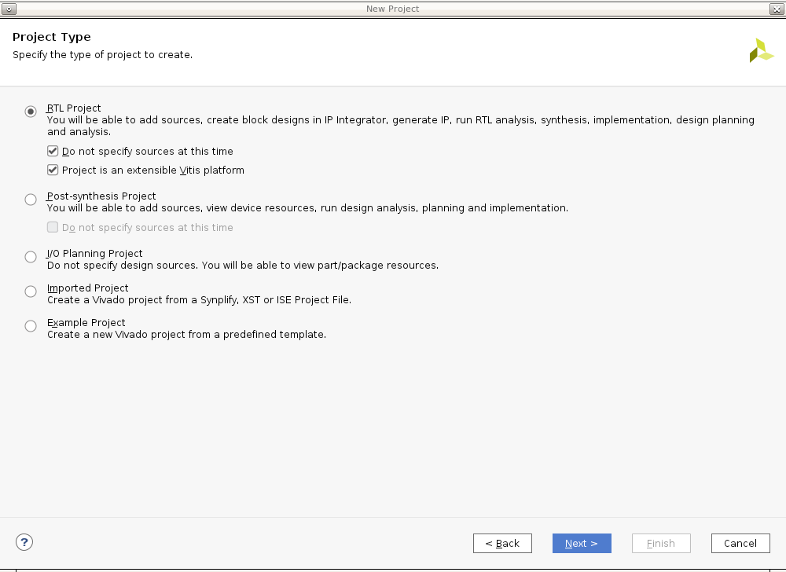
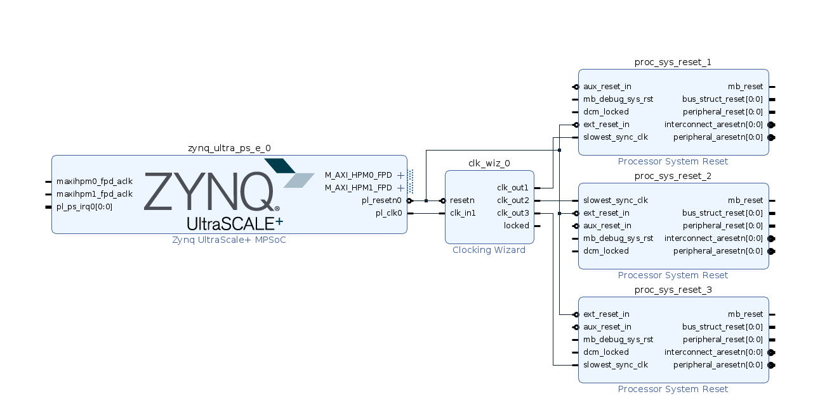
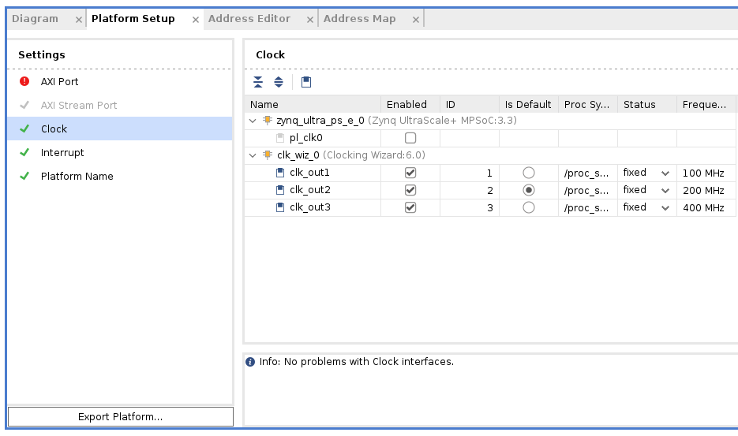

<!--
# Copyright 2020 Xilinx Inc.
#
# Licensed under the Apache License, Version 2.0 (the "License");
# you may not use this file except in compliance with the License.
# You may obtain a copy of the License at
#
#     http://www.apache.org/licenses/LICENSE-2.0
#
# Unless required by applicable law or agreed to in writing, software
# distributed under the License is distributed on an "AS IS" BASIS,
# WITHOUT WARRANTIES OR CONDITIONS OF ANY KIND, either express or implied.
# See the License for the specific language governing permissions and
# limitations under the License.
-->

## Step 1: Create the Vivado Hardware Design and Generate XSA

In this step, we will create the hardware design for the ZCU104 Vitis acceleation platform. We will start from a ZCU104 preset design, add platform required peripherals and configure them. After everything is set, we will export the hardware design to XSA.

### Create Base Vivado Project from Preset

1. Launch Vivado

   Run the following commands in Linux console.

   ```bash
   source <Vitis_Install_Directory>/settings64.sh
   vivado &
   ```

2. Create a Vivado project named **zcu104_custom_platform**.

   - Select **File->Project->New**, Click **Next**.
   - In Project Name dialog set Project name to **zcu104_custom_platform**. Click **Next**.
   - Enable **Project is an extensible Vitis platform**. Click **Next**.

   

   - Select **Boards** tab and then select **Zynq UltraScale+ ZCU104 Evaluation Board**. Click **Next**.
   - Review project summary and click **Finish**

   Note: If you need to change an existing Vivado project to an extensible platform project, you can go to **Settings** in **Flow Navigator** in an opened Vivado design, go to **General** and enable **project is an extensible Vitis platform**

   

3. Create a block design.

   - In **Project Manager**, under **IP INTEGRATOR**, select **Create Block Design**.
   - (Optional) Change the design name to **system**.
   - Click **OK**.

4. Add MPSoC IP and run block automation to configure it.

   - Right click Diagram view and select **Add IP**.
   - Search for `zynq` and then double-click the **Zynq UltraScale+ MPSoC** from the IP search results.
   - Click the **Run Block Automation** link to apply the board presets.
      In the Run Block Automation dialog, ensure the following is check marked:

      - All Automation
      - Zynq_ultra_ps_e_0
      - Apply Board Presets

   - Click **OK**. You should get MPSoC block configured like below:

   

**What Just Happended?**

At this stage, the Vivado block automation has added a Zynq UltraScale+ MPSoC block and applied all board presets for the ZCU104. The presets includes MPSoC PS block configurations and pin assignments. 

**What to do for custom boards?**

For a custom board, please double click MPSoC block and setup parameters according to the board hardware. Next we'll add the IP blocks and metadata to create a base hardware design that supports acceleration kernels.

### Customize System Design for Clock and Reset

V++ linker can automatically link the clock signals between kernel and platform. The available clock signals in the platform are exported by **PFM.CLK** property. 

For simple designs, interrupt signals can be sourced by processor's **pl_clk**. The limitation is that the processor has maximum 4 pl_clks and their phase is not aligned.

To provide more interrupt signals, or to provide phase aligned clocks, we can use **Clocking Wizard**. 

We will add the **Clocking Wizard** to the block diagram and enable clock signals for the platform. Here are the detailed steps.

1. Add the clocking wizard block to generate three clocks:

   - Right click Diagram view and select **Add IP**.
   - Search for and add a **Clocking Wizard** from the IP Search dialog.
   - Double-click the **clk_wiz_0** IP block to open the Re-Customize IP dialog box.
   - Click the **Output Clocks** tab.
   - Enable clk_out1 through clk_out3 in the Output Clock column. Set the **Requested Output Freq** as follows:

      - **clk_out1** to **100** MHz.
      - **clk_out2** to **200** MHz.
      - **clk_out3** to **400** MHz.

   - At the bottom of the dialog box set the **Reset Type** to **Active Low**.

   

   - Click **OK** to close the dialog.
    
   **Note: So now we have set up the clock system for our design. This clock wizard uses the pl_clk as input clock and generates clocks needed for the whole logic design. In this simple design, we would use 100MHz clock as the axi_lite control bus clock. 200MHz and 400MHz clocks are reserved for DPU AXI interface clock and DPU core clock during design linking phase. You are free to modify the clock quantities and frequency to fit your target design. We'll setup the clock export in future steps. Before that, we need to create reset signals for each clock because they are needed in clock export setup.**

3. Add three Processor System Reset blocks corresponging to the three clocks:

   - Right click Diagram view and select **Add IP**.
   - Search for and add a **Processor System Reset** from the IP Search dialog
   - Rename the reset block to **proc_sys_reset_1** so that it's easy to understand the relationship between reset modules and the clock signals.
   - Select the **proc_sys_reset_1** block, type Ctrl-C and Ctrl-V to replicate two modules. They are named as **proc_sys_reset_2** and **proc_sys_reset_3** by default.

4. Connect Clocks and Resets:

   - Click **Run Connection Automation**, which will open a dialog that will help connect the proc_sys_reset blocks to the clocking wizard clock outputs.
   - Enable All Automation on the left side of the Run Connection Automation dialog box.
   - Select **clk_in1** on clk_wiz_0, and set the Clock Source to **/zynq_ultra_ps_e_0/pl_clk0**.
   - For each **proc_sys_reset** instance, select the **slowest_sync_clk**, and set the Clock Source as follows:

      - **proc_sys_reset_1** with **/clk_wiz_0/clk_out1**
      - **proc_sys_reset_2** with **/clk_wiz_0/clk_out2**
      - **proc_sys_reset_3** with **/clk_wiz_0/clk_out3**

   - On each proc_sys_reset instance, select the **ext_reset_in**, set **Board Part Interface** to **Custom** and set the **Select Manual Source** to **/zynq_ultra_ps_e_0/pl_resetn0**.
   - Make sure all checkboxes are enabled, and click **OK** to close the dialog and create the connections.
   - Connect all the **dcm_locked** signals on each proc_sys_reset instance to the locked signal on **clk_wiz_0**.

   

5. Enable clocks for the platform

   - Go to **Platform Setup** tab. 
   - If it's not opened yet, use menu **Window -> Platform Setup** to open it.
   - Click **Clock** tab
   - Enable all clocks under clk_wiz_0: **clk_out1**, **clk_out2**, **clk_out3**
   - Change their ID to **0**, **1** and **2**
   - Set a default clock: click **Is Default** for **clk_out2**
   - After everything is setup, it should report **Info: No problem with Clock interface**.

   

   **Note**:


   - There should be one and only one default clock in the platform. During v++ linker will use the default clock to connect the IP blocks if there are no user assignments for link configuration.


### Add Interrupt Support

V++ linker can automatically link the interrupt signals between kernel and platform. The available interrupt signals in the platform are exported by **PFM.IRQ** property. 

For simple designs, interrupt signals can be sourced by processor's **pl_ps_irq**. The limitation is that it can only provide maximum 16 interrupt signals. To provide more interrupt signals, We can use **AXI Interrupt Controller**. We'll enable **AXI HPM0 LPD** to control the **AXI Interrupt Controller**, add the **AXI Interrupt Controller** and enable interrupt signals for **PFM.IRQ**. Here are the detailed steps.

1. Enable **AXI HPM0 LPD** to control the **AXI Interrupt Controller**

   - In the block diagram, double-click the **Zynq UltraScale+ MPSoC** block.
   - Select **PS-PL Configuration > PS-PL interfaces > Master interface**.
   - Enable the **AXI HPM0 LPD** option.
   - Expand the arrow before **AXI HPM0 LPD**. Check the **AXI HPM0 LPD Data width** settings and keep it as default **32**.
   - Disable **AXI HPM0 FPD** and **AXI HPM1 FPD**
   - Click **OK** to finish the configuration.

   **Note**:
   
   - We use **AXI HPM0 LPD** mainly for controlling purpose. It would read and write 32 bit control registers. If the interface is more than 32, AXI Interconnect or SmartConnect will do AXI bus width conversion using PL logic. It would cost logic resource and introduce unnecessary latency.
   - We reserve **AXI HPM0 FPD** and **AXI HPM1 FPD** for kernel usage. Disabling them from the block diagram can prevent auto connection to use it by accident. We can export the unused AXI interfaces in Platform Setup, no matter it's visible in the block diagram or not.

2. Add the **AXI Interrupt Controller** and configure it

   - Right click Diagram view and select **Add IP**, search and add **AXI Interrupt Controller** IP. It's instantiated as **axi_intc_0**.
   - Double click the AXI Interrupt Controller block, change **Interrupt Output Connection** to **Single** so that it can be connected to PS IRQ interface.
   - Click **OK**.

3. Connect AXI Interfaces of axi_intc_0 to AXI HPM0 LPD of PS

   - Click Run Connection Automation
   - Review the settings (**axi_intc_0** is enabled, **s_axi** is to be connect to **/zynq_ultra_ps_e_0/M_AXI_HPM0_LPD**)
   - Set **Clock Source for Slave Interface** and **Clock Source for Master Interface** to **/clk_wiz_0/clk_out2(200 MHz)**
   - Click **OK**

   Note:

   - We wish interrupt controller and most kernel IRQ signals are synchronous to one clock. It's best for stability. But don't worry about the asynchronous IRQ if kernels are running at different clocks. The interrupt controller can handle asynchronous IRQ with level interrupt signals as well.

4. Connect irq of the Interrupt Controller

   - Connect **axi_intc_0.irq** to **zynq_ultra_ps_e_0.pl_ps_irq[0:0]**

   Note:

   - If you have more than one irq signals to connect to pl_ps_irq of PS, use a **concat** IP to concatenate them to a bus and then connect the bus to pl_ps_irq.


5. Enable interrupt signals for the platform.

   - Go to Platform Setup tab
   - Go to Interrupt tab
   - Enable intr under axi_intc_0
   - Tcl console shows the corresponding tcl command for this setup: 

   ```
   set_property PFM.IRQ {intr { id 0 range 32 }} [get_bd_cells /axi_intc_0]
   ```

The IPI design connection would like below till now:


### Enable AXI Interfaces for the Platform

1. Enable AXI Master interfaces from PS

   - Go to Platform Setup tab
   - Go to AXI Port tab in Platform Setup
   - Under zynq_ultra_ps_e_0, enable **M_AXI_HPM0_FPD** and **M_AXI_HPM1_FPD**. Keep the Memport and sptag default to M_AXI_GP and empty.

   Note:

   - M_AXI_GP means general purpose AXI Master interface
   - sptag is only applicable to AXI slave interfaces.
   - v++ linker will instantiate AXI Interconnect automatically to connect between PS AXI Master interfaces and slave interfaces of acceleration kernels. One AXI Master interface will connet up to 16 kernels.

2. Enable AXI Master interfaces from AXI Interconnect

   - Under ps8_0_axi_periph, click M01_AXI, press Shift and click M07_AXI to multi-select master interfaces from M01_AXI to M07_AXI.
   - Right click the selection and click on Enable.
   - Keep the Memport and sptag default to M_AXI_GP and empty. 

   Note:

   - v++ will not cascade another level of AXI Interconnect if the AXI master interface is exported from AXI Interconnect IP.
   - AXI Master interfaces from PS and AXI Interconnect are functionally equvalent to the platform.
   - In general, platform designer should export as many as AXI interfaces to the platform. Application developer should decide which interface to use.

3. Enable AXI Slave interfaces from PS to allow kernels access DDR memory

   - Under zynq_ultra_ps_e_0, multi-select all AXI slave interfaces: press **Ctrl** and click **S_AXI_HPC0_FPD**, **S_AXI_HPC1_FPD**, **S_AXI_HP0_FPD**, **S_AXI_HP1_FPD**, **S_AXI_HP2_FPD**, **S_AXI_HP3_FPD**.
   - Right click the selections and select **enable**.
   - Change Memport of **S_AXI_HPC0_FPD** and **S_AXI_HPC1_FPD** to **S_AXI_HP** because we won't use any coherent features for these interfaces.
   - Type in simple sptag names for these interfaces so that they can be selected by v++ configuration during linking phase. **HPC0**, **HPC1**, **HP0**, **HP1**, **HP2**, **HP3**.

   


### Emulation Setup (Optional)

This step is only needed when creating an emulation-capable platform.

When a component comes with multiple types of simulation models, selecting SystemC TLM (Transaction-level Modeling) model would run much faster than RTL model. For Processing System component, it's mandatory to use TLM for Hardware Emulation.

1. Change PS simulation model to tlm

   - Select the PS instance **zynq_ultra_ps_e_0** in the block diagram
   - check the **Block Properties** window.
   - In **Properties** tab, it shows `ALLOWED_SIM_MODELS=tlm,rtl`. It means this component supports two types of simulation models.
   - Scroll down to `SELECTED_SIM_MODEL` property. Change it from **rtl** to **tlm** to select to use TLM model.
   - Notice the equvalent Tcl command shown in tcl console is:

   ```tcl
   set_property SELECTED_SIM_MODEL tlm [get_bd_cells /zynq_ultra_ps_e_0]
   ```


### Export Hardware XSA

1. Validate the block design 

   - Click the **Validate Design** button in the block design Diagram window

   **Note**: During validation, Vivado reports a critical warning that **/axi_intc_0/intr** is not connected. This warning can be safely ignored because v++ linker will link kernel interrupt signals to this floating intr signal.

   ```
   CRITICAL WARNING: [BD 41-759] The input pins (listed below) are either not connected or do not have a source port, and they don't have a tie-off specified. These pins are tied-off to all 0's to avoid error in Implementation flow.
   Please check your design and connect them as needed: 
   /axi_intc_0/intr
   ```

2. Create a top module wrapper for the block design

   - In **Source** tab, right click **system.bd** in Design Sources group
   - Select **Create HDL Wrapper...**
   - Select **Let Vivado manage wrapper and auto-update**. 
   - Click **OK** to generate wrapper for block design.

3. Generate pre-synth design

   - Select **Generate Block Design** from Flow Navigator
   - Select **Synthesis Options** to **Global**. It will skip IP synthesis during generation.
   - Click **Generate**. .

4. Export the platform

   - Click menu **File -> Export -> Export Platform** to launch the **Export Hardware Platform** wizard. This wizard can also be launched by **Export Platform** button in **Flow Navigator** or **Platform Setup** window.
   - Click Next in the first information page.
   - Select Platform Type: **Hardware and Hardware Emulation**, click Next. If you skipped the emulation setup previously, select **Hardware** here.
   - Select Platform State: **Pre-synthesis**, click Next
   - Input Platform Properties and click **Next**. For example,
     - Name: zcu104_custom_platform
     - Vendor: xilinx
     - Board: zcu104
     - Version: 0.0
     - Description: This platform provides high PS DDR bandwidth and three clocks: 100MHz, 200MHz and 400MHz.
   - Fill in XSA file name: **zcu104_custom_platform** and keep the export directory as default. 
   - Click **Finish**. 
   - **zcu104_custom_platform.xsa** will be generated. The export path is reported in the Tcl console. 

   Alternatively, the above export can be done in Tcl scripts

   ```tcl
   # Setting platform properties
   set_property platform.default_output_type "sd_card" [current_project]
   set_property platform.design_intent.embedded "true" [current_project]
   set_property platform.design_intent.server_managed "false" [current_project]
   set_property platform.design_intent.external_host "false" [current_project]
   set_property platform.design_intent.datacenter "false" [current_project]
   # Write pre-synthesis expandable XSA
   write_hw_platform -force -file ./zcu104_custom_platform.xsa
   ```


### Fast Track

Scripts are provided to re-create projects and generate outputs. To use these scripts, please run the following steps.

1. Run build

   ```
   # cd to the step directory, e.g.
   cd step1_vivado
   make
   ```
   
2. To clean the generated files, please run
   
   ```bash
   make clean
   ```

### Next Step 

Now we finish the Hardware platform creation flow, then we should go to the [Step2: Software platform creation](./step2.md)

<p align="center"><sup>Copyright&copy; 2021 Xilinx</sup></p>
